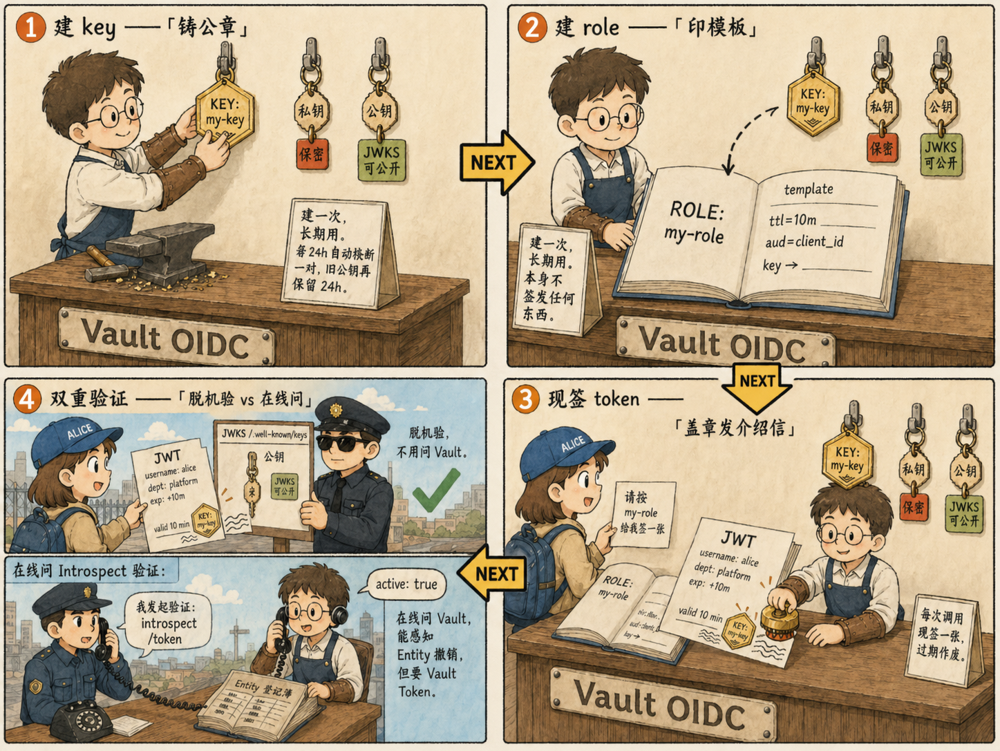

# 第二步：Identity Tokens——签出 JWT 并双重验证

[3.6 §3](/ch3-identity) 给的链路是：

key 是"长期公章"，role 是"开介绍信的模板"，token 是某次实际签出的
那一张 JWT——三者**不是同时生成**，是 key/role 各建一次后，**每次**
`vault read .../oidc/token/<role>` 都用 role 的模板 + key 的私钥**临
时**签一张新的出来。签出后的 JWT 有两种验证姿势：拿公钥**脱机验**
（JWKS），或在线问 Vault（introspect）。




参考链接：
- [Vault Identity Tokens 概念](https://developer.hashicorp.com/vault/docs/secrets/identity/identity-token)
- [OIDC ID Token 规范](https://openid.net/specs/openid-connect-core-1_0.html#IDToken)
- [JSON Web Key Set (JWKS) 规范 RFC 7517](https://www.rfc-editor.org/rfc/rfc7517)

我们一条命令一条命令把它跑通。

## 2.1 建一把 named key

```bash
vault write identity/oidc/key/my-key \
  rotation_period="24h" \
  verification_ttl="24h" \
  algorithm="RS256" \
  allowed_client_ids="*"
```

- `rotation_period`：每 24h 自动换一对新私钥；旧私钥立刻销毁
- `verification_ttl`：旧公钥还在 JWKS 上保留 24h，给已签出未过期的
  token 留验证窗口
- `allowed_client_ids="*"`：允许任何 role 用这把 key

## 2.2 准备一个 alice 用户来"持有 Entity"

我们要让一个真实的 Vault Token 持有 alice 的 Entity 才能为她签 JWT。
直接用 step 1 已经开好的 userpass。先写一个允许签 OIDC token 的最小
策略——光有 `default` 是不够的，`identity/oidc/token/<role>` 必须显
式授权：

```bash
vault policy write oidc-signer - <<EOF
path "identity/oidc/token/my-role" {
  capabilities = ["read"]
}
EOF
```

把这个策略和 `default` 一起挂到 alice 用户上：

```bash
vault write auth/userpass/users/alice \
  password="alice-pwd" \
  policies="default,oidc-signer"
```

登录拿一条 alice 的 Vault Token（保存到环境变量）：

```bash
ALICE_TOKEN=$(vault login -format=json -method=userpass username=alice password=alice-pwd | jq -r .auth.client_token)
echo "ALICE_TOKEN=${ALICE_TOKEN:0:20}..."
```

> ⚠️ 这一步登录会**临时切换** `VAULT_TOKEN`。把它切回 root 以免影响后续命令：
> ```bash
> export VAULT_TOKEN=root
> ```

userpass 登录的副作用：Vault 自动为 alice 在 userpass mount 上创建
了一个 alias。但她**还没绑到 step 1 的 `$ALICE_EID`**——验证一下：

```bash
vault write -format=json identity/lookup/entity \
  alias_name="alice" \
  alias_mount_accessor="$USERPASS_ACCESSOR" \
  | jq '.data | {id, name}'

# 同屏打印 ALICE_EID 方便肉眼比对
echo "ALICE_EID=$ALICE_EID"
```

如果返回的 `id` 和 step 1 的 `$ALICE_EID` 一致（应该一致——因为 step
1 §1.4 我们就已经把这个 alias 提前挂到那个 Entity 上了），说明她的
登录被归并到我们手工建的 Entity 上。完美。

> 如果你跳过了 step 1 直接做 step 2，也没关系——Vault 会自动新建一
> 个 Entity，下面的 token 签发流程一样能跑。

## 2.3 建一个带 template 的 role

```bash
vault write identity/oidc/role/my-role \
  key="my-key" \
  ttl="10m" \
  template='{"username":{{identity.entity.aliases.'$USERPASS_ACCESSOR'.name}},"groups":{{identity.entity.groups.names}},"department":{{identity.entity.metadata.department}}}'
```

读一下 role 看 Vault 自动生成的 `client_id`（也就是签出 JWT 的 `aud`）：

```bash
CLIENT_ID=$(vault read -format=json identity/oidc/role/my-role | jq -r .data.client_id)
echo "CLIENT_ID=$CLIENT_ID"
```

## 2.4 用 alice 的 Token 签发 JWT

**关键**：`identity/oidc/token/<role>` 只能为请求者**自己的** Entity
签 token，不能为别人签。所以这条命令必须用 `$ALICE_TOKEN`：

```bash
JWT=$(VAULT_TOKEN=$ALICE_TOKEN vault read -format=json identity/oidc/token/my-role | jq -r .data.token)
echo "JWT=$JWT"
```

肉眼可读地解一下 payload（JWT 第二段是 base64 编码的 JSON）：

```bash
echo "$JWT" | cut -d. -f2 | base64 -d 2>/dev/null | jq
```

你会看到类似：

```json
{
  "aud": "...CLIENT_ID...",
  "department": "platform",
  "exp": 1761234567,
  "groups": ["platform-team", "default"],
  "iat": 1761233967,
  "iss": "http://127.0.0.1:8200/v1/identity/oidc",
  "namespace": "root",
  "sub": "...$ALICE_EID...",
  "username": "alice"
}
```

注意三件事：

1. **标准 OIDC claim** (`iss/sub/aud/iat/exp`) 全在，由 Vault 自动加
2. **template 里写的字段** (`username`/`groups`/`department`) 也在，
   由 Vault 从 alice 的 Entity 元数据里渲染出来
3. `sub` 就是 alice 的 Entity ID（不是 alias name，不是 token ID
   ——Entity 才是 OIDC 意义上的"subject"）

## 2.5 验证姿势 A：JWKS / Discovery（脱离 Vault）

Vault 把 OIDC 标准的 `.well-known` 端点**无需鉴权**地暴露在
`/v1/identity/oidc/`：

```bash
curl -s http://127.0.0.1:8200/v1/identity/oidc/.well-known/openid-configuration | jq
```

公钥 JWKS：

```bash
curl -s http://127.0.0.1:8200/v1/identity/oidc/.well-known/keys | jq
```

任何标准 JWT/OIDC 库（Go `go-jose`、Python `python-jose`、Node `jose`
等）拿到这两个 URL 就能完整验证签名 + claim——**完全不需要 Vault
Token**。这就是 Identity Tokens 最大的工程价值：把"Vault 不在请求路
径上"做实。

## 2.6 验证姿势 B：introspect（在线、要 Vault Token）

```bash
vault write identity/oidc/introspect token="$JWT"
```

返回 `active true` 表示验证通过；如果你**先把 alice 这个 Entity 删了
再 introspect**，会拿到 `active false`——这就是 introspect 相对 JWKS
的唯一优势：能感知"Entity 已被删/禁用"。

代价是：

- 要为验证侧分配 Vault Token
- Vault 在请求路径上、要扛验证 QPS
- 失去了 OIDC "无状态验证" 的工程红利

> 选型口诀：**默认走 JWKS，只有需要"立即吊销"的高敏场景才上 introspect**。

---

> Step 3 把姿势升级——不再是"我让 Vault 给我签一张身份证"，而是
> "我让一整个外部应用走 OIDC Authorization Code Flow 来 Vault 登录"。
