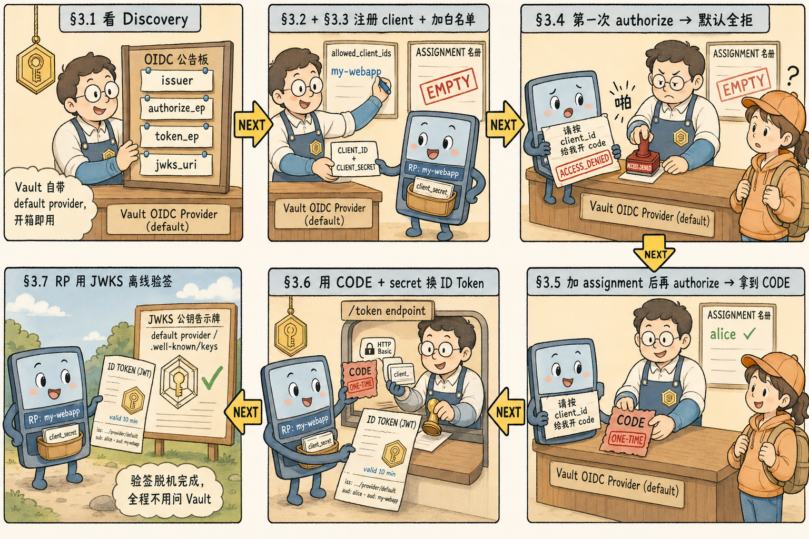

# 第三步：把 Vault 启用为 OIDC Provider，并跑一遍 Authorization Code Flow

Step 2 我们用 `identity/oidc/token/<role>` 让 Vault 给 alice 签了一
张 JWT——那是"我自己问 Vault 要"的姿势。

这一步换成**标准 OIDC IdP 姿势**：下游应用（"relying party / RP"）
通过 `authorization_endpoint` → `token_endpoint` 这条链路从 Vault 拿
ID Token。

整个实验的全景如下——下面 §3.1 ~ §3.7 就是把这张图里每一步亲手跑一遍：



参考链接：
- [Vault OIDC Provider 文档](https://developer.hashicorp.com/vault/docs/secrets/identity/oidc-provider)
- [OIDC Core 1.0 — Authorization Code Flow](https://openid.net/specs/openid-connect-core-1_0.html#CodeFlowAuth)

## 3.1 看默认 Provider 与 Discovery

Vault 每个 namespace 自带一个名为 `default` 的 OIDC provider 和一把
名为 `default` 的 key——**不需要手动建**。

```bash
vault read identity/oidc/provider/default

curl -s http://127.0.0.1:8200/v1/identity/oidc/provider/default/.well-known/openid-configuration | jq
```

记下里面几个关键 endpoint URL，等下要手动调：

```bash
ISSUER=$(curl -s http://127.0.0.1:8200/v1/identity/oidc/provider/default/.well-known/openid-configuration | jq -r .issuer)
AUTH_EP=$(curl -s "$ISSUER/.well-known/openid-configuration" | jq -r .authorization_endpoint)
TOKEN_EP=$(curl -s "$ISSUER/.well-known/openid-configuration" | jq -r .token_endpoint)
echo "ISSUER=$ISSUER"
echo "AUTH_EP=$AUTH_EP"
echo "TOKEN_EP=$TOKEN_EP"
```

注意 `authorization_endpoint` 指向的是 Vault **Web UI 的路径**——这
是 OIDC 协议要求的，因为终端用户必须在那里完成"输入用户名密码 / 点
GitHub 登录"等真实交互。

## 3.2 创建 client（先**不**配 assignments，体验默认全拒）

```bash
vault write identity/oidc/client/my-webapp \
  redirect_uris="http://localhost:9999/callback" \
  client_type="confidential"

vault read identity/oidc/client/my-webapp
```

留意输出里 `assignments []`——**默认是空数组，等于一个人都不让进**。
这是 [3.6 §4.4](/ch3-identity) 强调的"最容易被忽视的安全卡点"。我
们等下故意先用这个状态去试，看到失败再修。

读 client 凭据：

```bash
CLIENT_ID=$(vault read -format=json identity/oidc/client/my-webapp | jq -r .data.client_id)
CLIENT_SECRET=$(vault read -format=json identity/oidc/client/my-webapp | jq -r .data.client_secret)
echo "CLIENT_ID=$CLIENT_ID"
echo "CLIENT_SECRET=${CLIENT_SECRET:0:16}..."
```

## 3.3 把 client 加到 default provider 的 `allowed_client_ids`

默认 provider 的白名单也是空的——必须显式把 client_id 加进去：

```bash
vault write identity/oidc/provider/default \
  allowed_client_ids="$CLIENT_ID"
```

## 3.4 模拟 RP 走 Authorization Code Flow

真实 RP 的实现走完整的浏览器重定向。在终端里我们用 Vault 自带的快
捷 API `identity/oidc/provider/default/authorize` 直接拿 `code`——
它要求当前 token 已经登录过任意 auth method（这模拟了"用户在 Vault
UI 完成了 userpass 登录"那一步）。

先用 step 2 的 alice 凭据登录拿 token：

```bash
ALICE_TOKEN=$(vault login -format=json -method=userpass username=alice password=alice-pwd | jq -r .auth.client_token)
export VAULT_TOKEN=root  # 立刻切回避免污染
```

请求 authorize 端点拿 `code`。**注意它是 `GET` + query string**（OIDC
规范要求），不能用 `vault write`，得直接 `curl`；用户身份通过
`X-Vault-Token` header 携带：

```bash
STATE="state-$RANDOM"
NONCE="nonce-$RANDOM"

CODE_RESP=$(curl -s -G \
  -H "X-Vault-Token: $ALICE_TOKEN" \
  --data-urlencode "client_id=$CLIENT_ID" \
  --data-urlencode "redirect_uri=http://localhost:9999/callback" \
  --data-urlencode "response_type=code" \
  --data-urlencode "scope=openid" \
  --data-urlencode "state=$STATE" \
  --data-urlencode "nonce=$NONCE" \
  "$ISSUER/authorize")

echo "$CODE_RESP" | jq
```

**预期**：你会看到 `error "access_denied"` + `error_description "client
is not authorized to use the provider"` 之类的错误。**这就是"默认全
拒"在起作用**——alice 没有被任何 assignment 显式允许，Vault 直接拒
绝。

## 3.5 修复：加上 assignment

把 alice 的 Entity 显式列入 assignment：

```bash
ALICE_EID=$(vault read -format=json identity/entity/name/alice | jq -r .data.id)

vault write identity/oidc/assignment/let-alice-in \
  entity_ids="$ALICE_EID"

# 把 assignment 绑到 client 上
vault write identity/oidc/client/my-webapp \
  redirect_uris="http://localhost:9999/callback" \
  client_type="confidential" \
  assignments="let-alice-in"
```

再来一遍 authorize：

```bash
CODE_RESP=$(curl -s -G \
  -H "X-Vault-Token: $ALICE_TOKEN" \
  --data-urlencode "client_id=$CLIENT_ID" \
  --data-urlencode "redirect_uri=http://localhost:9999/callback" \
  --data-urlencode "response_type=code" \
  --data-urlencode "scope=openid" \
  --data-urlencode "state=$STATE" \
  --data-urlencode "nonce=$NONCE" \
  "$ISSUER/authorize")

echo "$CODE_RESP" | jq
CODE=$(echo "$CODE_RESP" | jq -r .code)
echo "CODE=$CODE"
```

这次能拿到一个一次性 `code`。

## 3.6 拿 `code` 去 token 端点换 ID Token

模拟 RP 的后端通信。token 端点用 HTTP Basic Auth 携带 client 凭据
（`client_secret_basic`），请求体是 `application/x-www-form-urlencoded`：

```bash
TOKEN_RESP=$(curl -s -u "$CLIENT_ID:$CLIENT_SECRET" \
  -d "grant_type=authorization_code" \
  -d "code=$CODE" \
  -d "redirect_uri=http://localhost:9999/callback" \
  "$TOKEN_EP")

echo "$TOKEN_RESP" | jq
```

返回里 `id_token` 字段就是签好的 OIDC JWT。同 step 2 的方法解 payload：

```bash
ID_TOKEN=$(echo "$TOKEN_RESP" | jq -r .id_token)
PAYLOAD=$(echo "$ID_TOKEN" | cut -d. -f2 | base64 -d 2>/dev/null)
echo "$PAYLOAD" | jq

# 把 §3.1 拿到的几个变量和 JWT claim 直接并排比对
echo
echo "ISSUER (§3.1)        = $ISSUER"
echo "iss     (in JWT)     = $(echo "$PAYLOAD" | jq -r .iss)"
echo "CLIENT_ID (§3.2)     = $CLIENT_ID"
echo "aud     (in JWT)     = $(echo "$PAYLOAD" | jq -r '.aud | if type=="array" then join(",") else . end')"
echo "ALICE_EID (§3.5)     = $ALICE_EID"
echo "sub     (in JWT)     = $(echo "$PAYLOAD" | jq -r .sub)"
echo "NONCE   (§3.4)       = $NONCE"
echo "nonce   (in JWT)     = $(echo "$PAYLOAD" | jq -r .nonce)"
```

对应关系一目了然：

- `iss` ≡ `$ISSUER`，**带 `/provider/default`**——这是 Provider 派
  的 token，与 step 2 那条"裸"identity token 的 `iss`
  （`/identity/oidc`）不一样
- `sub` ≡ `$ALICE_EID`，alice 的 Entity ID
- `aud` ≡ `$CLIENT_ID`
- `nonce` ≡ `$NONCE`，原样回填（OIDC 防重放设计）

**至此 Vault 作为 OIDC Provider 的端到端最小链路已经跑通。** 真实 RP
就是把 §3.4 那一段重定向交互换成浏览器、§3.6 这一段换成后端 HTTP
调用——协议本身和你刚才手动跑的完全一致。

## 3.7 复用 §2.5 验证：用 default provider 的 JWKS 验签

Provider 自己也有 `.well-known/keys`：

```bash
curl -s "$ISSUER/.well-known/keys" | jq
```

任何 OIDC 库拿这把公钥就能验 §3.6 那条 `id_token`。**这就是为什么
说"启用 OIDC Provider = 启用一个完整的 IdP"**——你已经具备了 Auth0 /
Keycloak 的最小可用功能集。
