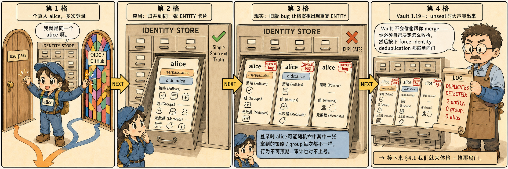
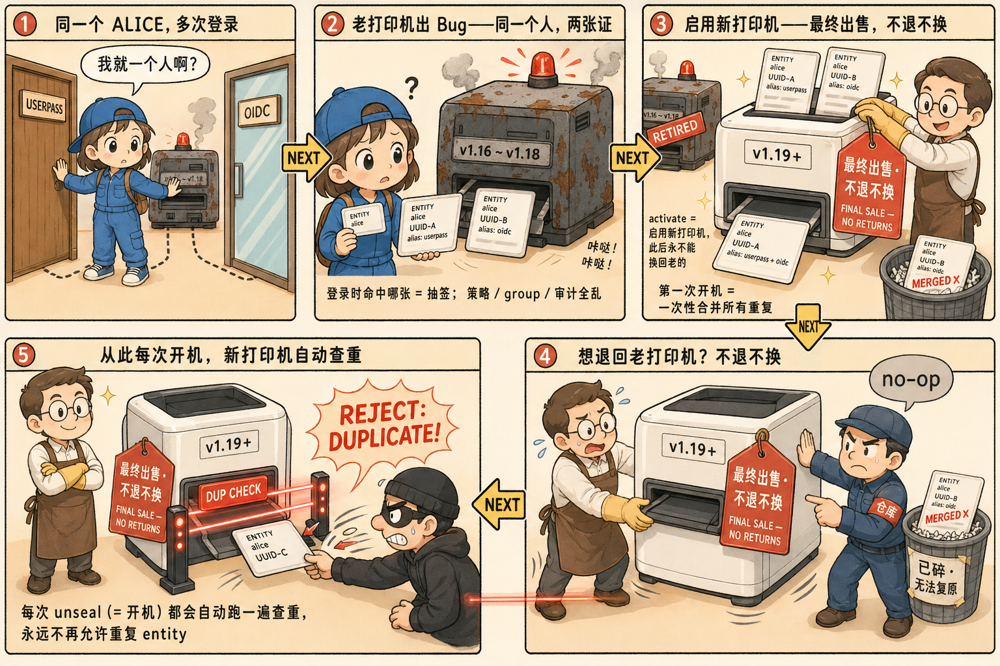

# 第四步：force-identity-deduplication 激活与不可逆语义

[3.6 §5](/ch3-identity) 介绍了 1.19+ 的去重激活机制：

- 旧版 Vault 的 bug 可能在持久化存储里留下重复 entity / alias / group
- 1.19+ 在 unseal 阶段会**主动检测**并打日志
- 提供一个**一次性、永远不可逆**的开关
  `sys/activation-flags/force-identity-deduplication/activate` 来彻
  底强制去重

这一步**完全自包含**——不依赖前 3 步的任何状态，可以直接从 step 4
开始跑。整个流程：§4.0 讲清楚要解决什么问题，§4.1 启动一个干净的
dev vault，§4.2 体检确认现状，§4.3 按 [hashicorp/vault#11277](https://github.com/hashicorp/vault/issues/11277)
的真实路径**手工造出一组重复 alias**，§4.4/§4.5 看 Vault 检测和激
活后的 dedup 行为，§4.6 验证开关本身的不可逆。

## 4.0 这个开关到底解决了什么问题？

先用两张图把"问题 → 解决方案 → 新保障"全讲清楚——后面 §4.1 ~ §4.6
就是亲手跑第二张图里的每一格：




> **两层不可逆一句话总结**：启用新打印机 = "最终出售、不退不换"
> （**开关不可逆**）；新打印机开机那一刻把两张证合并成一张，碎掉
> 的那张再也拼不回来（**合并不可逆**）。所以文档反复强调：推开关
> 之前先确认每一组重复确实该合并——合错了也没有"撤销 merge"。

下面 §4.1 ~ §4.6 就是亲手把图里每一格跑一遍。

## 4.1 启动一个干净的 Dev Vault（自包含起点）

step 4 完全自包含——下面这条命令就是这一节的"零号起点"，不依赖前
3 步的任何状态：

```bash
# 杀掉可能存在的旧 Dev Vault
pkill -f "vault server -dev" 2>/dev/null; sleep 2

# 启动新的 Dev Vault（Dev 模式只有 1 把 unseal key，等下要用）
nohup vault server -dev \
  -dev-root-token-id=root \
  -dev-listen-address=0.0.0.0:8200 \
  > /var/log/vault-dev.log 2>&1 &

for i in $(seq 1 20); do
  if vault status > /dev/null 2>&1; then echo "Vault is ready."; break; fi
  sleep 1
done

export VAULT_ADDR='http://127.0.0.1:8200'
export VAULT_TOKEN='root'

# 提取 unseal key（后面 §4.4/§4.5 手工 seal/unseal 要用）
UNSEAL_KEY=$(grep "Unseal Key:" /var/log/vault-dev.log | head -1 | awk '{print $NF}')
echo "UNSEAL_KEY=$UNSEAL_KEY"
```

## 4.2 体检：看日志和 flag 状态

Dev 模式 Vault 的日志在 `/var/log/vault-dev.log`：

```bash
grep -E "post-unseal setup starting|post-unseal setup complete|DUPLICATES DETECTED" /var/log/vault-dev.log
```

应该看到 setup starting → setup complete 两行夹着一段日志，**没有**
`DUPLICATES DETECTED` 一行——当前集群干净。

再看 activation flags 状态：

```bash
vault read sys/activation-flags
```

应该看到 `activated` 列表为空：

```
Key          Value
---          -----
activated    []
```

> 在生产里：如果 §4.2 这一步就看到了 `DUPLICATES DETECTED`，**绝对
> 不要**直接激活 flag。先按 [官方 deduplication 文档](https://developer.hashicorp.com/vault/docs/secrets/identity/deduplication)
> 第 2-3 步把重复手工分类、确认要怎么处理，再来推开关。激活之后做
> 出的合并是**不可逆**的。

## 4.3 制造一组同名重复 alias（hands-on）

接下来按 [hashicorp/vault#11277](https://github.com/hashicorp/vault/issues/11277)
里记录的真实路径，用纯 API 造出一组同名同 mount 的重复 alias。

> 为什么 1.19+ 还能造出来？API 层**已经堵死了**直接创建同名 alias
> 的入口（会返回 `duplicate identity name`）。但 #11277 发现了一条
> 绕过校验的路径：通过 `vault write identity/entity-alias/id/<alias_id>
> name=...` 改名，会触发隐式 merge 并在同一个 entity 上留下两条同
> 名同 mount 的 alias。

```bash
# 1) 开 userpass 并建一个用户
vault auth enable userpass
vault write auth/userpass/users/bsmith password="training" policies="default"

# 2) 模拟 bsmith 登录——这一步会在 userpass mount 上自动创建一条
#    name="bsmith" 的 alias，并归属于 Vault 自动新建的 Entity
vault login -method=userpass username=bsmith password=training

# 切回 root
export VAULT_TOKEN=root

# 3) 拿到 userpass mount 的 accessor
ACCESSOR=$(vault auth list -format=json | jq -r '."userpass/".accessor')
echo "ACCESSOR=$ACCESSOR"

# 4) 显式创建一个 entity "bob-smith"
EID=$(vault write -format=json identity/entity \
  name="bob-smith" policies="default" | jq -r .data.id)
echo "EID=$EID"

# 5) 在这个 entity 上挂一条名字暂时叫 "bob" 的 alias（合法）
ALIAS_ID=$(vault write -format=json identity/entity-alias \
  name="bob" canonical_id=$EID mount_accessor=$ACCESSOR | jq -r .data.id)
echo "ALIAS_ID=$ALIAS_ID"

# 6) **关键一步**：把这条 alias 改名成 "bsmith"
#    "bsmith" 这个名字已经被第 2 步登录创建的 alias 占用，
#    本来该被 API 层拒掉，但走 /id/ 改名路径会触发隐式 merge
vault write identity/entity-alias/id/$ALIAS_ID name=bsmith
```

最后那条命令会打印一条 WARNING（"alias is already tied to a
different entity; these entities are being merged …"）。

验证一下，**同一个 entity 身上确实挂了两条 name=bsmith 的 alias**：

```bash
EID2=$(vault read -format=json identity/entity-alias/id/$ALIAS_ID \
  | jq -r .data.canonical_id)

vault read -format=json identity/entity/id/$EID2 \
  | jq '.data.aliases | map({id, name, mount_path})'
```

输出会形如：

```json
[
  {"id": "<alias-id-A>", "name": "bsmith", "mount_path": "auth/userpass/"},
  {"id": "<alias-id-B>", "name": "bsmith", "mount_path": "auth/userpass/"}
]
```

这就是 1.19 文档反复警告的 "duplicate identity" 现场。它对上层的实
际影响（来自 [#11169](https://github.com/hashicorp/vault/issues/11169)
等真实生产报告）：登录 / lookup 命中哪条是抽签，策略匹配和审计
entity_id 时有时无。

## 4.4 Phase 1：seal/unseal → 观察 DUPLICATES DETECTED

Vault 1.19+ 在 unseal 阶段会扫描全量身份数据并把发现的重复打到
WARN 日志。**此时 flag 尚未激活**——它只报警、不动手：

```bash
vault operator seal
vault operator unseal "$UNSEAL_KEY"
```

看日志：

```bash
grep -iE "duplicate|identity:" /var/log/vault-dev.log | head -30
```

你会看到类似：

```
[WARN]  identity: 1 entity-alias duplicates found
[WARN]  identity: entity-alias "bsmith" with mount accessor "auth_userpass_xxxx" duplicates ...
```

但因为 `force-identity-deduplication` **尚未激活**，Vault 不会动手
处理——它只是告诉你"这里有脏数据，请先手工确认再激活"。这对应生
产里的正确流程：先看报告、再推开关。

## 4.5 Phase 2：激活 flag → 再次 seal/unseal → 观察自动去重

```bash
# 激活开关（一次性、不可逆！）
vault write -f sys/activation-flags/force-identity-deduplication/activate

# 确认激活
vault read sys/activation-flags
```

`activated` 列表应该已经包含 `force-identity-deduplication`。

激活时 Vault 会立刻打印两行日志，标记一次性 reload 的起讫时间——这
个区间在生产上就是"一次性合并"占用的窗口：

```bash
grep "force-identity-deduplication activated" /var/log/vault-dev.log
```

```
INFO core: force-identity-deduplication activated, reloading identity store
INFO core: force-identity-deduplication activated, reloading identity store complete
```

再走一次 seal/unseal 触发 dedup check：

```bash
vault operator seal
vault operator unseal "$UNSEAL_KEY"
```

看日志：

```bash
grep -iE "duplicate|deduplic|merging|renaming" /var/log/vault-dev.log | tail -30
```

这次 Vault **真的动手了**：

- **同名 alias**（同 mount + 同 name 指向不同 entity）→ Vault 把两
  个 entity **merge** 成一个，多余的 alias 删除
- **同名 entity**（不同 entity 但 name 相同）→ Vault 把后来那条
  **rename** 成 `name-<uuid>` 形式，保留所有数据

我们 §4.3 造的是第一种，所以应该看到 merge 动作。

验证去重结果：

```bash
# entity 的 aliases 现在只剩一条
vault read -format=json identity/entity/id/$EID2 \
  | jq '.data.aliases | map({id, name, mount_path})'

# 看所有 entity name
vault list identity/entity/name
```

根据 [官方 deduplication 文档](https://developer.hashicorp.com/vault/docs/secrets/identity/deduplication/entity-group)，
merge 不删数据、不新增权限，但**不可逆**：被删掉的那条 alias_id
从此消失，引用过它的 token / 审计日志全对不上号。

## 4.6 验证"不退不换"——开关本身的不可逆

再激活一次：

```bash
vault write -f sys/activation-flags/force-identity-deduplication/activate
```

Vault 不会报错，但后台不再做任何事情——新打印机已经在位，再按一
次按钮只是 no-op。更重要的是**不存在 `deactivate` 接口**——吊牌上
写的"最终出售、不退不换"名副其实。

这就是**两层不可逆**：

1. **开关不可逆**——新打印机回不去老的，该集群从此 unseal 都跑查重
2. **合并不可逆**——刚才 §4.5 碎掉的 alias_id 再也拼不回来

新打印机的完整工作流程一句话：

1. **检测**（unseal 时扫描存储）
2. **报警**（flag 未激活时只打 WARN 日志）
3. **处理**（flag 激活后自动 rename / merge）
4. **持续保障**（此后每次 unseal 都重复 1-3）

## 4.7 总结：老打印机 vs 新打印机

| 维度 | 老打印机（激活前） | 新打印机（激活后） |
| --- | --- | --- |
| 重复 entity / alias / group | 可能存在（旧版 bug 造成） | 第一次开机就自动处理 |
| 同名 entity（不同 entity 重名） | 不处理，只打 WARN 日志 | **重命名**为 `name-<uuid>` |
| 同名 alias（同 mount + 同 name 指向不同 entity） | 不处理，只打 WARN 日志 | **merge** 两个 entity 为一个，多余 alias 删除 |
| 未来出现新重复 | 可能（并发竞态 + 残留 bug） | 每次开机自动查重，发现即处理 |
| 退回老打印机 | — | **不行，最终出售、不退不换** |
| 撤销已处理的重复 | — | **不行，rename / merge 都不可逆** |

> §4.5 演示的是表格里**第三行**（同名 alias → merge）。第二行（同
> 名 entity → rename）的复现路径更隐蔽，常见于 PR 复制并发场景，
> 在单节点 Dev 模式上很难稳定造出来。

---

> 进入 Finish 总结。
