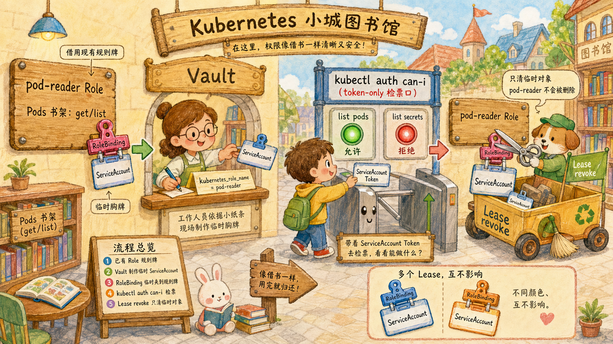

# 第 3 步：模式 B `kubernetes_role_name` —— 动态 RoleBinding + 临时 SA



模型：[3.11 §4.2](/ch3-k8s)。本步要：

1. 创建 Vault Role 引用现有 K8s Role `pod-reader`
2. 申领 token；观察 K8s 上多了一对临时 SA + 临时 RoleBinding
3. 验证 token 的权限来自 `pod-reader`
4. revoke → 临时对象立即消失，但 `pod-reader` Role 留下

---

## 3.1 创建 Vault Role

```bash
vault write kubernetes/roles/mode-b \
  allowed_kubernetes_namespaces="default" \
  kubernetes_role_name="pod-reader" \
  token_default_ttl="10m"
```

## 3.2 申领前快照

```bash
kubectl get sa,rolebinding -n default --no-headers 2>/dev/null | grep 'mode-b' || echo "(目前无 mode-b 临时对象)"
```

如果只看到 `NAME` 表头，说明命令把 `kubectl get` 的标题行也过滤出来了，并不表示已经有临时对象。
这里加上 `--no-headers` 后，未申领前应直接输出“目前无 mode-b 临时对象”。

## 3.3 申领

```bash
CRED=$(vault write -format=json kubernetes/creds/mode-b kubernetes_namespace=default)
TOKEN=$(echo "$CRED" | jq -r .data.service_account_token)
SA=$(echo "$CRED" | jq -r .data.service_account_name)
LEASE=$(echo "$CRED" | jq -r .lease_id)

echo "临时 SA: $SA"
echo "Lease : $LEASE"
```

## 3.4 申领后快照 —— 多了两个对象

```bash
kubectl get sa/"$SA" rolebinding/"$SA" -n default
```

应能看到一个临时 SA 与一个同名临时 RoleBinding。
Vault 默认会用同一个生成名创建这两个对象，名称形如 `v-<调用者>-mode-b-<时间戳>-<随机串>`。
注意：`pod-reader` 这个 Role 是实验开始前就存在的“权限模板”。模式 B 不会新建、修改或删除它；Vault 只新建临时 SA 与临时 RoleBinding，让这个临时 SA 通过 RoleBinding 使用 `pod-reader` 已有的权限。

```bash
kubectl describe rolebinding "$SA" -n default
```

## 3.5 验证权限

```bash
K8S_SERVER=$(kubectl config view --minify -o 'jsonpath={.clusters[0].cluster.server}')
TOKEN_KUBECONFIG=/tmp/vault-k8s-token-only.conf
: > "$TOKEN_KUBECONFIG"

kc_token() {
  kubectl --kubeconfig="$TOKEN_KUBECONFIG" \
    --server="$K8S_SERVER" \
    --insecure-skip-tls-verify=true \
    --token="$TOKEN" "$@"
}

kc_token -n default auth can-i list pods       # yes
kc_token -n default auth can-i list secrets    # no
```

## 3.6 revoke → 临时对象消失，Role 留下

```bash
vault lease revoke "$LEASE"
sleep 1
kubectl get sa/"$SA" rolebinding/"$SA" -n default 2>/dev/null || echo "(临时对象已被清理)"
kubectl get role pod-reader -n default
```

## 3.7 多 Lease 隔离演示

```bash
CRED1=$(vault write -format=json kubernetes/creds/mode-b kubernetes_namespace=default)
LEASE1=$(echo "$CRED1" | jq -r .lease_id)
SA1=$(echo "$CRED1" | jq -r .data.service_account_name)

CRED2=$(vault write -format=json kubernetes/creds/mode-b kubernetes_namespace=default)
LEASE2=$(echo "$CRED2" | jq -r .lease_id)
SA2=$(echo "$CRED2" | jq -r .data.service_account_name)

echo "现在有两组临时对象："
kubectl get sa/"$SA1" rolebinding/"$SA1" sa/"$SA2" rolebinding/"$SA2" -n default

echo ">>> revoke 第一个 lease"
vault lease revoke "$LEASE1"
sleep 1
kubectl get sa/"$SA1" rolebinding/"$SA1" -n default 2>/dev/null || echo "第一组已清理"
kubectl get sa/"$SA2" rolebinding/"$SA2" -n default
echo "(应该只剩一组)"

vault lease revoke "$LEASE2"
```

---

## ✅ 验收

- [ ] 申领后 `default` ns 多了同名的临时 SA 与临时 RoleBinding（名称包含 `mode-b`）
- [ ] 这两个对象的 RoleBinding `roleRef` 指向 `pod-reader`
- [ ] 使用 token-only 的 `kubectl` 验证权限：list pods=yes，list secrets=no
- [ ] revoke 单条 lease 只清那一组临时对象，另一组仍在
- [ ] revoke 全部后 `pod-reader` Role 仍然存在
