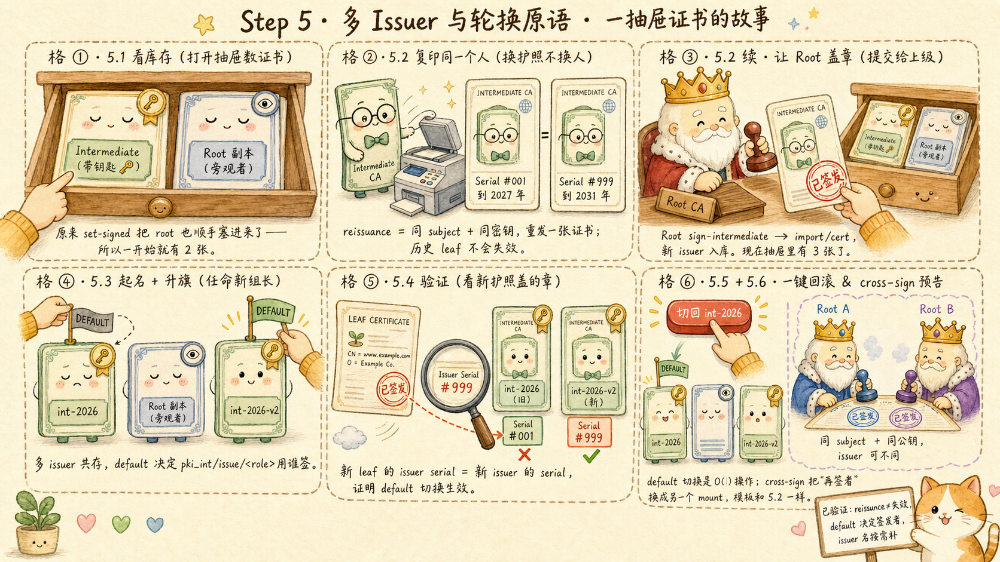

# 第 5 步：多 Issuer 与轮换原语 —— reissuance / cross-sign / default 切换



模型见 [3.X §6](/ch3-pki)。自 Vault 1.11 起，**单个 mount 可以拥有多张 issuer 证书**——这是做证书轮换的基础设施。
本步演示三件事：

1. 给 `pki_int/` 添加第二张 issuer（reissuance：同 subject + 同密钥的新证书）
2. 切换 `default` issuer，观察新签发的 leaf 用哪张 CA
3. cross-sign 概念演示（同 subject + 同公钥，issuer 可不同）

---

## 5.1 看当前 pki_int 的 issuer 列表

```bash
vault list pki_int/issuers
vault read pki_int/config/issuers
```

应当看到 **2 张** issuer——这是因为 Step 2 里 `pki/root/sign-intermediate` 用 `format=pem_bundle` 返回的 `.data.certificate` 字段是**"intermediate + root" 拼成的 PEM bundle**，`set-signed` 把两张都导入了 `pki_int/`：一张是带内部私钥的 intermediate（与 mount 内的密钥配对，能用来签发），另一张是被顺带导入的 Root 副本。`default` 指向前者。

> **（编者注）** Step 2 用 `pki_int/intermediate/generate/internal` 时即使传 `issuer_name="int-2026"` 也不会生效——这个端点不接受 issuer 名参数，issuer 名只能在 `set-signed` / `issuers/import/*` 时设置，或事后用 `vault write pki_int/issuer/<id> issuer_name=...` 补名。所以现在两张 issuer 都是匿名 UUID。

可以用下面这条命令看清楚每张 issuer 的 subject 与 issuer 名，分辨谁是谁：

```bash
for id in $(vault list -format=json pki_int/issuers | jq -r '.[]'); do
  echo "── $id ──"
  vault read -field=certificate pki_int/issuer/$id \
    | openssl x509 -noout -subject -issuer
done
```

> **（编者注）** 这其实是 Step 2 的一个小副作用：如果只想保留 intermediate，可以在 `set-signed` 前用 `jq -r '.data.certificate' | awk '/BEGIN/{n++} n==1' > pki_int.crt` 只取第一张证书。本实验里保留两张正好为 5.2 演示"一个 mount 多个 issuer"提供了天然样本。

## 5.2 在 pki_int 上做一次 reissuance（同 subject + 同密钥）

reissuance = 给同一个 subject 用同一份密钥重新签一张证书（通常 issuer 也是同一个 Root，但有效期延长）。

先按 subject 找出 intermediate 那张 issuer 的 ID（`pki_int/intermediate/generate/internal` 不接受 `issuer_name`，所以两张都是匿名 UUID，需要按证书内容辨认），并顺手给它命名 `int-2026`：

```bash
INT_ISSUER_ID=$(for id in $(vault list -format=json pki_int/issuers | jq -r '.[]'); do
  subj=$(vault read -field=certificate pki_int/issuer/$id | openssl x509 -noout -subject)
  case "$subj" in *"example.com Intermediate"*) echo "$id"; break ;; esac
done)
echo "intermediate issuer id: $INT_ISSUER_ID"

vault write pki_int/issuer/$INT_ISSUER_ID issuer_name="int-2026"

KEY_REF=$(vault read -format=json pki_int/issuer/int-2026 | jq -r '.data.key_id')
echo "reusing key: $KEY_REF"
```

用同一密钥生成**新的 CSR**（保留 subject）：

```bash
vault write -format=json pki_int/intermediate/generate/existing \
    key_ref="$KEY_REF" \
    common_name="example.com Intermediate" \
    issuer_name="int-2026-reissue" \
    | tee int_reissue_gen.json | jq '.data.csr | .[0:80] + "..."'

jq -r '.data.csr' int_reissue_gen.json > pki_int_reissue.csr
```

让 Root 签这张新 CSR，TTL 给久一点（模拟到期前提前续签）：

```bash
vault write -format=json pki/root/sign-intermediate \
    csr=@pki_int_reissue.csr \
    format=pem_bundle \
    ttl=43800h | jq -r '.data.certificate' > pki_int_reissue.crt

openssl x509 -in pki_int_reissue.crt -noout -subject -issuer -dates
```

把这张新证书**作为新 issuer 导入**到 `pki_int/`：

```bash
vault write -format=json pki_int/issuers/import/cert \
    pem_bundle=@pki_int_reissue.crt | jq '.data.imported_issuers, .data.imported_keys'

vault list pki_int/issuers
```

应当看到现在有**三张 issuer**（5.1 的 2 张 + 这次导入的 reissue）——新导入的那张与原 intermediate 同 subject、同公钥，但 serial 不同（即 reissuance）。

## 5.3 给新 issuer 起名，并把它设为 default

新导入那张目前还没名字。要在多张匿名 issuer 中挑出"subject 是 intermediate 且**不是** `int-2026`"的那张，按 subject + 名字双条件过滤：

```bash
NEW_ISSUER_ID=$(for id in $(vault list -format=json pki_int/issuers | jq -r '.[]'); do
  info=$(vault read -format=json pki_int/issuer/$id)
  name=$(echo "$info" | jq -r '.data.issuer_name')
  subj=$(echo "$info" | jq -r '.data.certificate' | openssl x509 -noout -subject)
  case "$subj" in
    *"example.com Intermediate"*)
      [ "$name" != "int-2026" ] && echo "$id" && break ;;
  esac
done)
echo "new issuer id: $NEW_ISSUER_ID"

vault write pki_int/issuer/$NEW_ISSUER_ID issuer_name="int-2026-v2"

# 切换 default
vault write pki_int/config/issuers default="int-2026-v2"
vault read pki_int/config/issuers
```

## 5.4 验证新签发的 leaf 用了新 issuer

```bash
vault write -field=certificate pki_int/issue/example-dot-com \
    common_name="new.example.com" ttl=24h \
    | openssl x509 -noout -issuer -serial
```

留意 `issuer` 仍是 `CN = example.com Intermediate`（subject 没变），但**它来自新的 issuer**——可以对比新旧 issuer 的 serial：

```bash
vault read -field=certificate pki_int/issuer/int-2026 \
  | openssl x509 -noout -serial
vault read -field=certificate pki_int/issuer/int-2026-v2 \
  | openssl x509 -noout -serial
```

## 5.5 切回旧 issuer 也只是一条命令

```bash
vault write pki_int/config/issuers default="int-2026"
```

> **关键事实**：
> - 多 issuer 共存于同一 mount，**按名字或 ID** 引用；`default` 决定 `pki_int/issue/<role>` 用哪张签。
> - reissuance 后两张 issuer 的 `ca_chain` 仅首项不同（除非被 `manual_chain` 阻止）。
> - **所有现有 leaf 仍然有效**——它们的 issuer 字段已固化在证书里，不会因为 default 切换而失效。

## 5.6 cross-sign 是什么（演示概念，不强求完整跑）

cross-sign = 拿"已有 CA B 的 subject + 公钥"用"另一张 CA A"再签一张证书，让 B 的 leaf 在信任 A 的客户端那边也能验证通过。

> **要求**（来自 [3.X §6](/ch3-pki)）：相同 Subject、相同公钥（key material）；Issuer **可能**不同（may），Serial Number **一定**不同（will）。
>
> 真实生产用途：root 轮换时让新旧 root 互签，过渡期间所有 leaf 都能验证。
>
> **（工程补充）** 完整 cross-sign 流程涉及两个独立的 CA mount，这里 Step 5.2 的 reissuance 已经把"多 issuer + 切 default"的操作面演示清楚；cross-sign 只是把"再签者"换成另一个 CA mount，命令模板与 5.2 类似（也是 `sign-intermediate` + `issuers/import/cert`）。

---

## ✅ 验收

- [ ] `vault list pki_int/issuers` 显示有 **3 张** issuer（intermediate、被顺带导入的 Root 副本、reissue 的 intermediate）
- [ ] 5.4 新签的 leaf 用的是新 issuer（serial 与 5.2 后导入的一致）
- [ ] 5.5 切回旧 default 后再签发，issuer 又换回去
- [ ] 你能解释为什么 reissuance 不会让历史 leaf 失效
