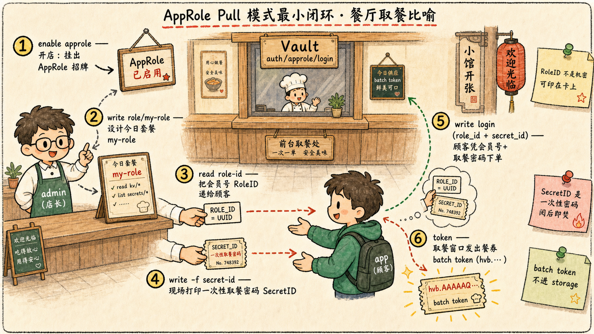

# 第一步：启用 approle，按官方 CLI 步骤跑通 Pull 模式

[4.2 章 §1](/ch4-app-role) 讲过：AppRole 是 Vault 内置的认证方法，跟
`userpass`、`ldap`、`jwt` 平起平坐，也是个挂在 `auth/` 下的插件。
[4.2 章 §4.1](/ch4-app-role) 解释了 Pull 模式的含义：**SecretID 由
Vault 现场生成**，不是客户端造好塞进来。

这一步严格按照 [官方 Configuration → Via the CLI](https://developer.hashicorp.com/vault/docs/auth/approle#via-the-cli)
的最小步骤跑一遍 Pull 模式登录，先把"最小可用的 AppRole 闭环"建立
起来——后续 step 的所有约束 / wrapping 都是在这个闭环上加东西。

## 1.1 启用 AppRole 认证方法

这就是 [4.1 章](/ch4-auth-basic) 那张表里"挂载式插件"的标准命令：

```bash
vault auth enable approle
```

`vault auth list` 看一眼挂载点：

```bash
vault auth list | grep approle
```

应该能看到一行 `approle/   approle    auth_xxxxx`——它默认就挂在
`auth/approle/` 下。如果想挂在别的路径上，加 `-path=<custom>`，命令
是 `vault auth enable -path=<custom> approle`。

## 1.2 创建一个 role

```bash
vault write auth/approle/role/my-role \
    token_type=batch \
    secret_id_ttl=10m \
    token_ttl=20m \
    token_max_ttl=30m \
    secret_id_num_uses=40
```

每个字段的含义：

| 字段 | 含义 |
| :--- | :--- |
| `token_type=batch` | [4.2 章 §7.1](/ch4-app-role) 解释过：官方推荐 AppRole 配 batch token——签出来的 token 不进 storage，零跟踪开销，但不可吊销 |
| `secret_id_ttl=10m` | SecretID 自身的存活窗口——10 分钟后即便没用过也作废 |
| `token_ttl=20m` | 登出来的 token 初始 TTL |
| `token_max_ttl=30m` | token 的硬上限——续期再多次也不能超过这个时长 |
| `secret_id_num_uses=40` | 单个 SecretID 最多能被用 40 次换 token |

> 这个命令直接照搬自 [官方 CLI 配置示例](https://developer.hashicorp.com/vault/docs/auth/approle#via-the-cli)，
> 是最小可用配置——**没有任何安全约束**（`bind_secret_id` 走默认 true，
> 没限 CIDR），适合 step 1 把通路打通。Step 2/3 再逐项加约束。

## 1.3 取出 RoleID（可被嵌进镜像的"用户名"）

[4.2 章 §3](/ch4-app-role) 里强调过：**RoleID 不是机密**，它是个静
态 UUID，可以写进镜像、环境变量、Terraform 模板里。

```bash
vault read auth/approle/role/my-role/role-id
```

输出形如：

```
Key        Value
---        -----
role_id    db02de05-fa39-4855-059b-67221c5c2f63
```

这一段抄一下，等下登录要用：

```bash
ROLE_ID=$(vault read -field=role_id auth/approle/role/my-role/role-id)
echo "ROLE_ID=$ROLE_ID"
```

## 1.4 取一个 SecretID（必须保密的"密码"）

注意是 `vault write -f`（带 `-f`）——`secret-id` 端点是 POST 类型，
**没有请求体**也得用 write，不能用 read。

```bash
vault write -f auth/approle/role/my-role/secret-id
```

输出形如：

```
Key                   Value
---                   -----
secret_id             6a174c20-f6de-a53c-74d2-6018fcceff64
secret_id_accessor    c454f7e5-996e-7230-6074-6ef26b7bcf86
secret_id_num_uses    40
secret_id_ttl         10m
```

字段一一对应 1.2 里 role 的配置。

> `secret_id_accessor` 跟 token 的 accessor 是一回事——可用来在不持
> 有 SecretID 本身的情况下查询 / 撤销这个 SecretID。**accessor 不能
> 用来登录**，所以可以放心写到日志里。

抓出来：

```bash
SECRET_ID=$(vault write -f -field=secret_id auth/approle/role/my-role/secret-id)
echo "SECRET_ID=$SECRET_ID"
```

> 注意：执行上面这条命令会**再生成一个全新的 SecretID**——也就是说
> 你现在手里其实有两个 SecretID 了。`auth/approle/role/<role>/secret-id`
> 端点每次调用都会新生一份，旧的一份仍然有效，直到自己 TTL 到期或被
> 用完。要看这个 role 现在到底有几个 active SecretID：
>
> ```bash
> vault list auth/approle/role/my-role/secret-id
> ```
>
> 会列出**所有还活着的 secret_id_accessor**——返回的是 accessor 不
> 是 SecretID 本身，符合"SecretID 永远不能被读出来"的原则。

## 1.5 用 RoleID + SecretID 登录

这是 [官方 Authentication → Via the CLI](https://developer.hashicorp.com/vault/docs/auth/approle#via-the-cli-1)
里那条登录命令：

```bash
vault write auth/approle/login \
    role_id=$ROLE_ID \
    secret_id=$SECRET_ID
```

输出形如：

```
Key                     Value
---                     -----
token                   hvb.AAAAAQI...（一串很长的 base64）
token_accessor          n/a
token_duration          20m
token_renewable         false
token_policies          ["default"]
identity_policies       []
policies                ["default"]
token_meta_role_name    my-role
```

几个注意点：

- `token` 是 `hvb.` 开头——**这就是 batch token 的特征**（service
  token 是 `hvs.` 或 `s.` 开头）。1.2 里我们写了 `token_type=batch`，
  这里印证
- `token_accessor: n/a` —— batch token 没有 accessor（它根本不进
  storage，没法追踪）
- `token_renewable: false` —— batch token 不能续期，只能等 30 分钟
  `token_max_ttl` 到期
- `token_policies: ["default"]` —— role 没指定 `policies`，所以只有
  Vault 内置的 default 策略

## 1.6 拿这枚 token 试一下能干什么

```bash
APP_TOKEN=$(vault write -field=token auth/approle/login \
    role_id=$ROLE_ID \
    secret_id=$SECRET_ID)

VAULT_TOKEN=$APP_TOKEN vault token lookup
```

会看到这枚 token 的元信息。注意 `policies` 字段只有 `default`——它
**不能读 KV、不能管引擎**——因为 role 没绑定任何实质性 policy。这
也是 trusted broker 模式的一个具体体现：**应用 token 的权限永远只覆
盖它真正需要的那一小撮路径**（[4.2 章 §6.3](/ch4-app-role)）。

## 1.7 这一步的核心闭环

到这里你已经把 AppRole 的最小闭环跑通了：



**问题**：上面这套交付，5 步里 admin 把 RoleID 和 SecretID 都直接
甩给了 app——这本身**违反 [4.2 章 §6](/ch4-app-role) 那条 trusted
broker 原则**（两半凭据不能在中间任何系统同时出现）。Step 4 会用
Response Wrapping 修复这一点，让 admin / broker 永远不接触明文
SecretID。

下一步先把 1.2 里没设的两个约束（`bind_secret_id`、`secret_id_num_uses=1`）
加上，亲手验证它们的作用。
