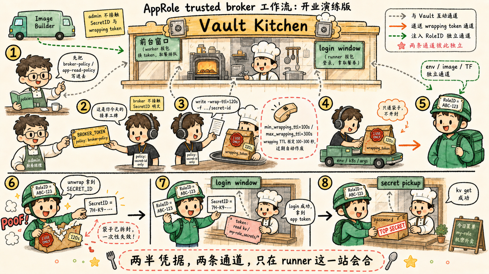

# 第四步：Response Wrapping——trusted-broker 工作流端到端

[4.2 章 §6](/ch4-app-role) 把 trusted broker 范式总结成一句话：**严
禁让任何一个系统（除最终客户端外）同时握有 RoleID 和 SecretID**。
[4.2 章 §5.2](/ch4-app-role) + Jenkins 工作流给出了具体的修复手段：
**把 SecretID 装进 Response Wrapping 的"一次性信封"，broker 全程只
接触信封、不接触内容**。

这一步把这条工作流从头到尾敲一遍，并且**故意演一次双重 unwrap**——
让你亲眼看到 wrapping 在被偷看时立刻识破的现场。

## 4.1 演练角色

| 角色 | 身份 | 在 Vault 里有什么权限 |
| :--- | :--- | :--- |
| **admin** | 你（root token） | 全部权限（设置 role、policy） |
| **worker** | broker，对应 [4.2 章 §6.2](/ch4-app-role) 那个 Jenkins worker | 拿一枚带 `min_wrapping_ttl` / `max_wrapping_ttl` 限制的 token，**只能取 wrapped SecretID** |
| **runner** | 最终消费者 | 通过 wrapping token 拿到 SecretID + 用 RoleID + SecretID 登录 + 读机密 |

## 4.2 admin：建一个 KV 机密 + 应用要读的策略

```bash
# 启用 KV-v2，写一个机密
vault secrets enable -path=kv kv-v2 2>/dev/null || true
vault kv put kv/my-role_secrets/app1 password="real-secret-pwd-xyz"
```

应用 token 用的策略——只能读这一个路径：

```bash
vault policy write app-read-policy - <<EOF
path "kv/data/my-role_secrets/*" {
  capabilities = [ "read" ]
}
EOF
```

把这个策略绑到 role 上：

```bash
vault write auth/approle/role/my-role \
    token_type=batch \
    bind_secret_id=true \
    secret_id_ttl=10m \
    secret_id_num_uses=1 \
    token_ttl=20m \
    token_max_ttl=30m \
    token_policies="app-read-policy"
```

> 注意：role 上加 `token_policies` 之后，每次登出来的 token 都会自带
> 这条策略——这是在 Vault 端把"应用 token 只能读它需要的那点机密"
> 钉死的标准做法。

## 4.3 admin：给 broker（worker）发一个范围严格限定的 token

[4.2 章 §6.2](/ch4-app-role) 引的官方策略——**只能取 wrapped
SecretID，且 wrapping TTL 必须落在 100–300 秒之间**：

```bash
vault policy write broker-policy - <<EOF
path "auth/approle/role/+/secret*" {
  capabilities = [ "create", "read", "update" ]
  min_wrapping_ttl = "100s"
  max_wrapping_ttl = "300s"
}
EOF
```

> `min_wrapping_ttl` / `max_wrapping_ttl` 是**ACL 字段**——这是策略
> 层（不是 role 层）的硬约束。**没有 wrap-ttl 的请求会被直接拒**；
> wrap-ttl 不在 100–300 之间也会被拒。这是把"裸 SecretID 偷溜出去"
> 在策略层就堵死的关键。

发一个 broker token：

```bash
BROKER_TOKEN=$(vault token create -policy=broker-policy -ttl=1h -field=token)
echo "BROKER_TOKEN=$BROKER_TOKEN"
```

## 4.4 worker：用这枚 token 取裸 SecretID（应该被拒）

按 [4.2 章 §8.2](/ch4-app-role) 那条反模式：worker 试图直接取裸
SecretID——策略 `min_wrapping_ttl` 这道防线应该立刻把这次请求拒掉：

```bash
VAULT_TOKEN=$BROKER_TOKEN vault write -f auth/approle/role/my-role/secret-id
```

会看到错误：

```
Error writing data to auth/approle/role/my-role/secret-id: Error making API request.

URL: PUT http://127.0.0.1:8200/v1/auth/approle/role/my-role/secret-id
Code: 403. Errors:

* permission denied
```

> 错误是 `permission denied` 而不是 `wrapping required`——但根因就是
> 缺了 `-wrap-ttl`，策略里 `min_wrapping_ttl=100s` 的最小要求没满
> 足，ACL 把请求直接拦掉。换句话说：**这个 broker token 永远不可能
> 拿到裸 SecretID**。

## 4.5 worker：用 -wrap-ttl 取 wrapped SecretID

带上 `-wrap-ttl=120s`（落在 [100, 300] 区间内）：

```bash
WRAPPED=$(VAULT_TOKEN=$BROKER_TOKEN vault write -wrap-ttl=120s -f \
    -format=json auth/approle/role/my-role/secret-id)
echo "$WRAPPED" | jq .

WRAPPING_TOKEN=$(echo "$WRAPPED" | jq -r '.wrap_info.token')
echo "WRAPPING_TOKEN=$WRAPPING_TOKEN"
```

输出形如：

```json
{
  "wrap_info": {
    "token": "hvs.CAESI...（一串）",
    "accessor": "...",
    "ttl": 120,
    "creation_time": "...",
    "creation_path": "auth/approle/role/my-role/secret-id",
    "wrapped_accessor": "..."
  }
}
```

注意：**返回里没有 `secret_id` 字段**——SecretID 被装进了 wrapping
token 的 Cubbyhole 里，worker 全程接触不到 SecretID 的明文。这就是
[4.2 章 §5.2](/ch4-app-role) 引的官方原话："we can guarantee that
only this application can read it"。

## 4.6 runner：用 wrapping token unwrap 拿到 SecretID

实际生产里 worker 会把 `WRAPPING_TOKEN` 当变量传给 runner（环境变
量、k8s ProjectedVolume 等等）。这里直接模拟 runner 端：

```bash
# runner 端：拿到 wrapping token，去 Vault unwrap
SECRET_ID=$(VAULT_TOKEN=$WRAPPING_TOKEN vault unwrap -field=secret_id)
echo "runner 拿到的 SECRET_ID=$SECRET_ID"
```

> `vault unwrap` 是个特殊端点：**它本身不需要常规的 Vault token**——
> 拿 wrapping token 设成 `VAULT_TOKEN` 环境变量去调就行。Vault 看到
> 这枚 token 是 wrapping 类型，就走 unwrap 逻辑。

runner 还需要 RoleID——这条不走 wrapping，走另一条通道（典型方式：
镜像构建期注入、环境变量、k8s ConfigMap）。这里直接通过 admin 的
root token 取一下模拟：

```bash
ROLE_ID=$(vault read -field=role_id auth/approle/role/my-role/role-id)
```

> **关键点**：到这里为止，**worker 全程没有 SecretID 的明文**
> （它只摸到 wrapping token），**runner 同时握着 RoleID 和 SecretID**。
> 这就是 [4.2 章 §1](/ch4-app-role) 那条 "two halves only meet on
> the end-user system" 的字面实现。

## 4.7 runner：用 RoleID + SecretID 登录，读机密

```bash
APP_TOKEN=$(vault write -field=token auth/approle/login \
    role_id=$ROLE_ID \
    secret_id=$SECRET_ID)

VAULT_TOKEN=$APP_TOKEN vault kv get kv/my-role_secrets/app1
```

应该看到 `password   real-secret-pwd-xyz`——一条 trusted broker 工作
流就完整跑通了。

## 4.8 反演：双重 unwrap 立刻失败（"中途偷看"识破现场）

[4.2 章 §5.2](/ch4-app-role) 引的最后一句："Vault throws a use-limit
error when an application tries to read the SecretID"——这一节亲自演
一遍。重新拿一个新的 wrapping token：

```bash
WRAPPED=$(VAULT_TOKEN=$BROKER_TOKEN vault write -wrap-ttl=120s -f \
    -format=json auth/approle/role/my-role/secret-id)
WRAPPING_TOKEN=$(echo "$WRAPPED" | jq -r '.wrap_info.token')
```

模拟"攻击者"先 unwrap（偷看了一次）：

```bash
VAULT_TOKEN=$WRAPPING_TOKEN vault unwrap -field=secret_id > /dev/null
echo "攻击者已经偷读过一次"
```

合法 runner 紧接着试图 unwrap 同一个 wrapping token：

```bash
VAULT_TOKEN=$WRAPPING_TOKEN vault unwrap -field=secret_id
```

立刻报错：

```
Error making API request.

URL: PUT http://127.0.0.1:8200/v1/sys/wrapping/unwrap
Code: 400. Errors:

* wrapping token is not valid or does not exist
```

> 这就是审计层用来识破的根因——**wrapping token 的 `num_uses` 是硬
> 编码的 1**，被用过一次就立刻销毁。合法应用收到这个错误就知道
> "wrapping token 在到达我之前已经被人 unwrap 过"——一定要立刻报警。

[4.2 章 §9](/ch4-app-role) 引的两条审计告警里第二条就是这个：
_"agent 尝试 unwrap 一枚已经被使用过的 wrapping token 时被 Vault 拒
绝"_——审计日志会留下两次 unwrap 调用的来源 IP / 时间，运维可以直
接定位到偷读发生在哪台机器上。

## 4.9 这一步的核心闭环



到这一步：admin 不接触 SecretID 与 wrapping token；broker 不接触
SecretID 明文；runner 是**唯一**同时握有 RoleID 和 SecretID 的位置——
完整对应 [4.2 章 §6](/ch4-app-role) 的 trusted broker 范式。

本实验到此结束。如果想把这套实验从 Vault 上清掉：

```bash
# 关掉 approle 认证方法 = 撕掉所有它签出来的 token + 删掉所有 role 配置
vault auth disable approle

# 关掉 KV 引擎
vault secrets disable kv

# 删 step 4 留下的应用读策略 + broker 策略
vault policy delete app-read-policy
vault policy delete broker-policy
```

> 注意：[4.1 章](/ch4-auth-basic) 那张表里讲过的 "禁用一个 Auth
> Method = 批量登出所有通过它登录的 Token" 在这里直接见效——执行
> `vault auth disable approle` 会把 runner 拿到的应用 token 一并失效
> （哪怕它还没到 TTL）。
