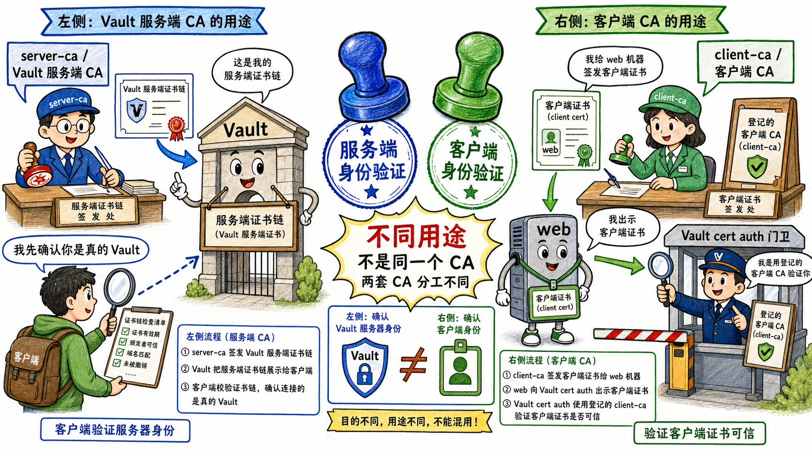

# 第一步：认识 TLS Vault 与实验用证书



cert auth 的实验和前面很多 HTTP dev 模式不同：这里的 Vault 监听在 HTTPS 上，并且 TLS listener 会接收客户端证书。

## 1.1 查看 Vault TLS 状态

后台脚本已经生成服务端证书并初始化、解封 Vault。先确认环境变量和状态。

```bash
echo "$VAULT_ADDR"
echo "$VAULT_CACERT"
vault status
```

`VAULT_ADDR` 应为 `https://127.0.0.1:8200`，`VAULT_CACERT` 指向 `/root/cert-lab/server-ca.crt`。

## 1.2 查看证书主题与用途

查看成功样例客户端证书的 Subject、SAN 与 Extended Key Usage。

```bash
openssl x509 -in /root/cert-lab/web-client.crt -noout -subject -issuer
openssl x509 -in /root/cert-lab/web-client.crt -noout -ext subjectAltName -ext extendedKeyUsage

openssl x509 -in /root/cert-lab/db-client.crt -noout -subject -issuer
openssl x509 -in /root/cert-lab/db-client.crt -noout -ext subjectAltName -ext extendedKeyUsage
```

`web-client` 应包含 `DNS:web-01.example.org` 与 `TLS Web Client Authentication`；`db-client` 由同一个客户端 CA 签发，但 SAN 和 OU 与后续 `web` role 不匹配。

## 1.3 这一步的核心闭环

`server-ca.crt` 是客户端用来信任 Vault 服务端的；`client-ca.crt` 是 Vault cert auth 用来信任客户端证书的。两个 CA 的用途不同，不要混用。