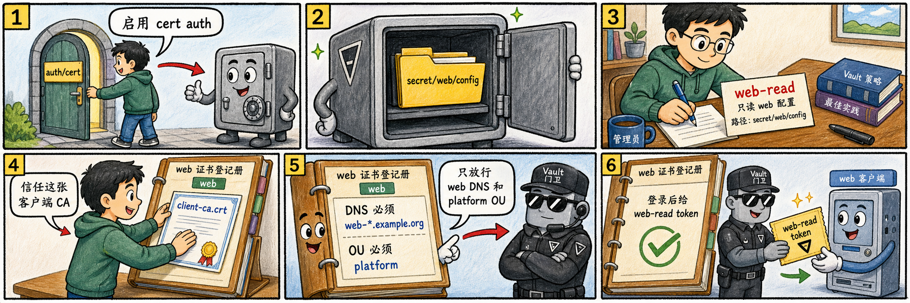

# 第二步：启用 cert auth 并登记 web 证书 role



配置 `auth/cert/certs/web` 时，我们会登记客户端 CA，并把证书约束和 token policy 绑在同一个 role 上。后台已经为这个非 dev TLS Vault 显式启用了 `secret/` KV v2 mount，方便我们验证登录后的读权限。

## 2.1 写入教学 secret 与 policy

```bash
vault secrets list | grep secret/
vault kv put secret/web/config username=web password=from-cert-auth

cat > web-read.hcl <<'EOF'
path "secret/data/web/config" {
  capabilities = ["read"]
}
EOF

vault policy write web-read web-read.hcl
```

## 2.2 启用 cert auth

```bash
vault auth enable cert
vault auth list | grep cert
```

默认挂载路径是 `auth/cert/`；如果使用不同路径，登录端点也要随之变化。

## 2.3 登记 web role

把客户端 CA 写入 `certificate`，再用 DNS SAN 和 OU 约束收紧允许登录的客户端证书。

```bash
vault write auth/cert/certs/web \
  display_name=web \
  certificate=@/root/cert-lab/client-ca.crt \
  allowed_dns_sans="web-*.example.org" \
  allowed_organizational_units="platform" \
  token_policies="web-read" \
  token_ttl="15m"
```

## 2.4 回读 role

```bash
vault read auth/cert/certs/web
vault list auth/cert/certs
```

你应能看到 `web` role，并能看到 `allowed_dns_sans`、`allowed_organizational_units`、`token_policies` 等配置。

## 2.5 这一步的核心闭环

`certificate=@client-ca.crt` 负责“证书链是否可信”，`allowed_dns_sans` 和 `allowed_organizational_units` 负责“这张可信证书是否属于允许的身份范围”，`token_policies` 决定登录成功后能访问什么。