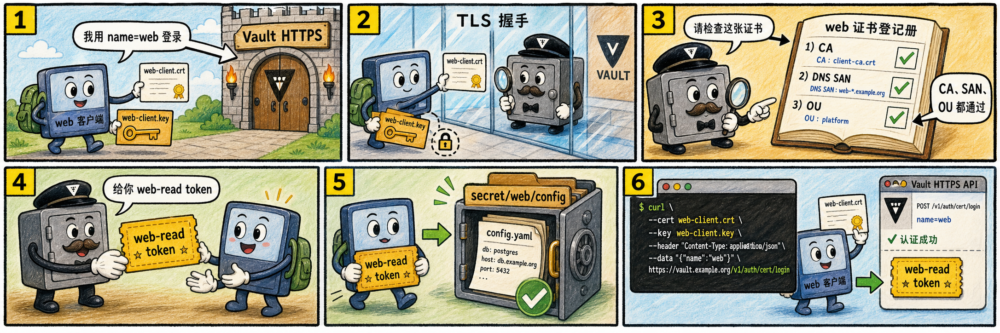

# 第三步：使用客户端证书登录并读取 secret



登录时，客户端通过 TLS 连接提交证书；请求体中的 `name=web` 让 Vault 只 against `web` 这个证书 role 匹配。

## 3.1 使用 Vault CLI 登录

```bash
WEB_LOGIN=$(vault login \
  -method=cert \
  -ca-cert=/root/cert-lab/server-ca.crt \
  -client-cert=/root/cert-lab/web-client.crt \
  -client-key=/root/cert-lab/web-client.key \
  name=web \
  -format=json)

echo "$WEB_LOGIN" | jq '.auth | {policies, lease_duration, renewable}'
WEB_TOKEN=$(echo "$WEB_LOGIN" | jq -r '.auth.client_token')
```

这里的 `-ca-cert` 是 Vault 服务端 TLS 证书的 CA，不是签发 `web-client.crt` 的客户端 CA。

## 3.2 用新 token 读取 secret

```bash
VAULT_TOKEN="$WEB_TOKEN" vault kv get secret/web/config
```

如果读取成功，说明客户端证书已经被转换为带 `web-read` policy 的 Vault token。

## 3.3 使用 curl 直接调用 API

API 登录同样要通过 TLS 客户端证书完成；请求体里可以指定 `name`。

```bash
curl --request POST \
  --cacert /root/cert-lab/server-ca.crt \
  --cert /root/cert-lab/web-client.crt \
  --key /root/cert-lab/web-client.key \
  --data '{"name":"web"}' \
  "$VAULT_ADDR/v1/auth/cert/login" | jq '.auth | {policies, lease_duration, renewable}'
```

## 3.4 这一步的核心闭环

私钥始终留在客户端本地；Vault 通过 TLS 握手确认客户端持有私钥，并通过 `auth/cert/certs/web` 的 CA 与约束判断是否签发 token。