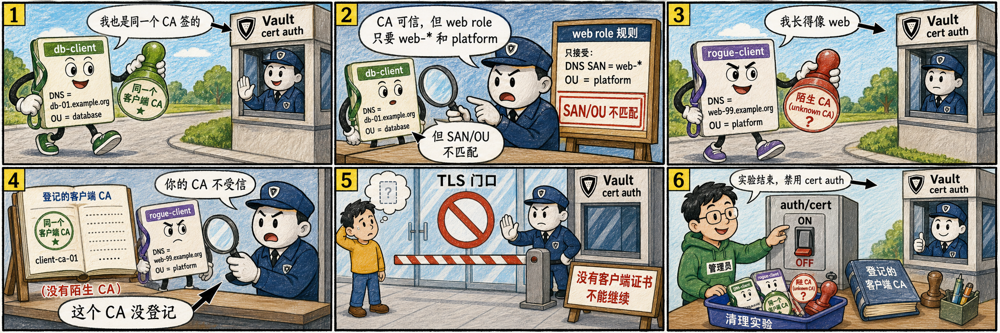

# 第四步：验证失败场景并清理环境



cert auth 的判断不是单一检查：证书链要可信，role 上已配置的 CN、SAN、OU、required extensions 等约束也要命中。

## 4.1 CA 可信但 role 约束不匹配

`db-client.crt` 是由同一个客户端 CA 签发的，所以证书链可信；但它的 DNS SAN 和 OU 不符合 `web` role 的约束，因此登录应失败。

```bash
vault login \
  -method=cert \
  -ca-cert=/root/cert-lab/server-ca.crt \
  -client-cert=/root/cert-lab/db-client.crt \
  -client-key=/root/cert-lab/db-client.key \
  name=web
```

## 4.2 DNS 像 web 但 CA 不受信

`rogue-client.crt` 的名称看起来像 web，但它不是由登记到 `web` role 的客户端 CA 签发，因此也应失败。

```bash
vault login \
  -method=cert \
  -ca-cert=/root/cert-lab/server-ca.crt \
  -client-cert=/root/cert-lab/rogue-client.crt \
  -client-key=/root/cert-lab/rogue-client.key \
  name=web
```

## 4.3 不带客户端证书也不能登录

```bash
curl --request POST \
  --cacert /root/cert-lab/server-ca.crt \
  --data '{"name":"web"}' \
  "$VAULT_ADDR/v1/auth/cert/login"
```

没有客户端证书时，登录端点没有可匹配的客户端身份材料，因此不会签发 token。

## 4.4 收尾清理

```bash
vault auth disable cert || true
```

禁用 auth method 会移除这个 mount 下的 cert role，并使通过该 auth method 签发的 token 失效。

## 4.5 这一步的核心闭环

`cert` auth 的“放行”来自两层同时成立：客户端证书要能链到登记的 CA，证书内容还要满足已配置的 role 约束；任何一层不满足都不能换到 Vault token。