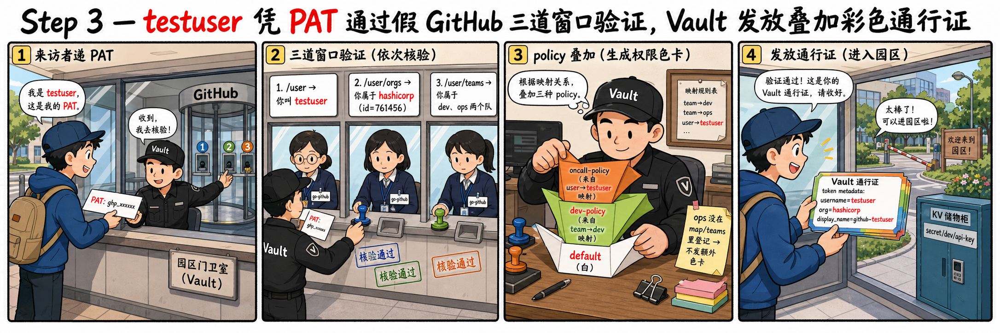

# 第三步：team / user 双映射 + 真实登录、查看 token metadata



[4.4 章 §5](/ch4-github) 介绍了 policy 是按 `map/teams/<slug>` 与
`map/users/<login>` 叠加生成的——team 名字必须 slugified、user 名
字按 GitHub login。本步先编写两条 policy、配置两条映射，然后执行
一次**真实的** `vault login -method=github`，把 mock 返回的
testuser / hashicorp 这条身份转换为 Vault token。

## 3.1 编写两条最小 policy

`dev-policy` 用于 dev team、`oncall-policy` 用于特定 user：

```bash
vault policy write dev-policy - <<'POL'
# dev team 获得的能力
path "secret/data/dev/*"     { capabilities = ["read", "list"] }
path "secret/metadata/dev/*" { capabilities = ["list"] }
POL

vault policy write oncall-policy - <<'POL'
# 给 user 个人追加的能力
path "sys/health" { capabilities = ["read"] }
POL

vault policy list | grep -E 'dev-policy|oncall-policy'
```

## 3.2 配置 team mapping

mock 中 `/user/teams` 返回 `dev` 与 `ops` 两个 team——把 `dev` 映
射到 `dev-policy`，`ops` 故意**不**映射，稍后观察其在 metadata 中
是否出现 group alias：

```bash
vault write auth/github/map/teams/dev value=dev-policy
vault list auth/github/map/teams
```

`vault list` 应能看到 `dev`。

> [4.4 章 §5.2](/ch4-github)：Vault 查询映射时**对同一个 team 同
> 时尝试 `team.name` 和 `team.slug`**——本实验 mock 中 `name=dev`
> 与 `slug=dev` 一致，故无歧义。如果 mock 把 name 改成
> "Site Reliability"、slug 仍为 `site-reliability`，写映射时按 slug
> 写最稳妥。

## 3.3 配置 user mapping

mock 中 `/user` 返回 `login: testuser`——映射到 `oncall-policy`：

```bash
vault write auth/github/map/users/testuser value=oncall-policy
vault list auth/github/map/users
```

## 3.4 真实登录：vault login -method=github

```bash
unset VAULT_TOKEN  # 否则环境变量会覆盖 token helper
vault login -method=github token=ghp_FAKE_BUT_VAULT_DOES_NOT_CARE
```

> **回顾 [4.4 章 §2](/ch4-github) 中的端点表**：这一条命令触发
> Vault 在内部**按顺序调用 3 条 GitHub API**（`/orgs/{org}` 不在此
> 列——它仅在写 config 且 `organization_id` 仍为空时被调用一次，
> step 2 已完成）：
>
> 1. `GET /user`：获取 `login=testuser`
> 2. `GET /user/orgs?per_page=100`：获取
>    `[{login:hashicorp, id:761456}]`，比对
>    `config.organization_id=761456` → 命中
> 3. `GET /user/teams?per_page=100`（Vault 1.19.2 vendored 版
>    go-github 仍发送 `hellcat-preview` accept）：获取
>    `[{slug:dev, organization.id:761456}, {slug:ops, ...}]`
> 4. 查询 `map/teams/dev` → `dev-policy`；查询 `map/teams/ops` →
>    不存在；查询 `map/users/testuser` → `oncall-policy`
> 5. token policies = `[default, dev-policy, oncall-policy]`
> 6. token metadata = `{username: testuser, org: hashicorp}`

应输出形如：

```
Success! You are now authenticated. ...

Key                    Value
---                    -----
token                  hvs.CAES...
token_accessor         ...
token_duration         768h
token_renewable        true
token_policies         ["default" "dev-policy" "oncall-policy"]
identity_policies      []
policies               ["default" "dev-policy" "oncall-policy"]
token_meta_username    testuser
token_meta_org         hashicorp
```

> **PAT 的具体内容并不重要**——mock 不校验 token 值，始终返回同一
> 个 `testuser`。这是 mock 的行为，不是 Vault 的行为。在真实
> GitHub 上，PAT 错误时第一条 `GET /user` 即会返回 401。

## 3.5 在 nginx 日志中完整查看本次 login 调用了哪些 API 与 Accept

```bash
echo '=== 本次 login 触发的所有请求 ==='
tail -10 /var/log/nginx/access.log | grep go-github
```

应能看到 3 条 `ua=go-github`（`/orgs/{org}` 在 step 2 已被调用过，
本次不会再调用），**重点**：

- `GET /user HTTP/1.1` accept=`application/vnd.github.v3+json`
- `GET /user/orgs?per_page=100 HTTP/1.1` accept=`application/vnd.github.v3+json`
- `GET /user/teams?per_page=100 HTTP/1.1` accept=`application/vnd.github.hellcat-preview+json`

> **此条 Accept 不是协议合同、是 Vault 1.19.2 vendored 老版
> `go-github` 的实现细节**：升级 Vault 之后 `/user/teams` 可能切回
> `v3+json`，mock 也会需要相应调整 spec 才能正常运行——这是预期之
> 中的。请以 `tail /var/log/nginx/access.log` 中实际看到的 Accept
> 为准，不要把本文档当作官方接口规范。

## 3.6 查看签发的 token 的细节

```bash
vault token lookup
```

关键字段：

| 字段 | 期望 |
| :-- | :-- |
| `display_name` | `github-testuser`（[4.4 章 §6](/ch4-github)） |
| `meta.username` | `testuser` |
| `meta.org` | `hashicorp` |
| `policies` | `[default dev-policy oncall-policy]` |
| `entity_id` | 一个 UUID（identity entity 自动生成） |

## 3.7 验证 entity 与 group alias

GitHub 登录会创建一个 identity alias，参见
[4.4 章 §6](/ch4-github)：

```bash
ENTITY_ID=$(vault token lookup -format=json | jq -r '.data.entity_id')
echo "entity_id=$ENTITY_ID"

vault read identity/entity/id/$ENTITY_ID -format=json \
  | jq '{name: .data.name, aliases: [.data.aliases[] | {name, mount_type}], group_ids: .data.group_ids}'
```

应能看到 `aliases` 中含一条
`{"name":"testuser", "mount_type":"github"}`。

至于 team——Vault 在登录时确实把 `dev`、`ops` 当作 group alias 名
塞进了 `auth.GroupAliases`，但**group alias 只有在绑定到一个事先
创建好的 external identity group 时才会被持久化**——否则
`vault list identity/group-alias/id` 会返回空：

```bash
export VAULT_TOKEN=root
vault list identity/group-alias/id 2>/dev/null
# 默认情况下：No value found at identity/group-alias/id/
```

这是 Vault identity 的设计：自动把任何 auth method 报上来的 group
名都建一个 entity group 会泛滥成灾，因此 Vault 要求运维**先**显式
建一个 `type=external` 的 group + alias，登录时 Vault 才会把对应
的 entity 加进该 group 的 `member_entity_ids`。

如果想看到完整效果，可以执行下面这段（**选学，跳过不影响后续步骤**）：

```bash
# 1. 取 github auth method 的 accessor（identity alias 必须挂在
#    某个 mount accessor 上）
GITHUB_ACCESSOR=$(vault auth list -format=json | jq -r '."github/".accessor')
echo "GITHUB_ACCESSOR=$GITHUB_ACCESSOR"

# 2. 建一个 external identity group，并直接给它绑 dev-policy
GROUP_ID=$(vault write -format=json identity/group \
    name=dev-from-github \
    type=external \
    policies=dev-policy \
    | jq -r '.data.id')
echo "GROUP_ID=$GROUP_ID"

# 3. 给该 group 建 alias：name 必须 = GitHub 那边的 team 名 dev，
#    canonical_id = 上一步的 group id，mount_accessor = github mount
vault write identity/group-alias \
    name=dev \
    canonical_id=$GROUP_ID \
    mount_accessor=$GITHUB_ACCESSOR

# 4. 重新登录一次，让 Vault 把 testuser 的 entity 写进该 group
unset VAULT_TOKEN
vault login -method=github token=anything > /dev/null

# 5. 现在 group-alias 与 group 都看得到了
export VAULT_TOKEN=root
vault list identity/group-alias/id
vault read identity/group/name/dev-from-github \
  | grep -E 'member_entity_ids|policies'
```

应能看到 `member_entity_ids` 里出现 testuser 对应的 entity id。
具体细节由 [2.5 章 identity entity](/ch2-identity-entity) 介绍。

## 3.8 使用该 token 操作 secret/data/dev/*

切换到 dev token、写入一个 secret 验证权限是否生效：

```bash
# 重新登录获取一份 dev 的 token
unset VAULT_TOKEN
vault login -method=github token=anything-still-works

DEV_TOKEN=$(vault print token)
echo "DEV_TOKEN=$DEV_TOKEN"

# dev-policy 仅授予 read 权限，先用 root 写入一条
VAULT_TOKEN=root vault secrets enable -path=secret -version=2 kv 2>/dev/null \
  || VAULT_TOKEN=root vault kv list secret/ >/dev/null 2>&1
VAULT_TOKEN=root vault kv put secret/dev/api-key value=hello-from-root

# 使用 dev token 读取
VAULT_TOKEN=$DEV_TOKEN vault kv get secret/dev/api-key
```

应能读到 `value: hello-from-root`——`dev-policy` 的 `read` 权限已
生效。

> dev mode 下的 Vault 默认已挂载 `secret/`（KV v2）；上述
> `secrets enable` 会因已存在而被忽略（用 `||` 兜底）。

尝试越权操作（应被拒绝）：

```bash
VAULT_TOKEN=$DEV_TOKEN vault kv put secret/dev/another value=should-fail 2>&1 | head -3
VAULT_TOKEN=$DEV_TOKEN vault kv get secret/prod/api-key 2>&1 | head -3
```

第一条会返回 `permission denied`（dev-policy 未授予 update）；第二
条会返回 `permission denied`（dev-policy 不覆盖
`secret/data/prod/*`）。

## 3.9 切回 root

```bash
export VAULT_TOKEN=root
vault token lookup | head -3
```

应回到 root。

## 3.10 本步骤的核心闭环

`vault login -method=github token=...` 真实地让 Vault 调用了 3 条
GitHub API（常态下）、按 `map/teams/dev` + `map/users/testuser`
叠加出 policies、签发的 token 自带 `username` / `org` metadata、能
且仅能按 policy 操作 secret——整个流程在协议层面与"接真 GitHub"
完全一致。下一步将通过修改 mock 构造各种失败现场。
