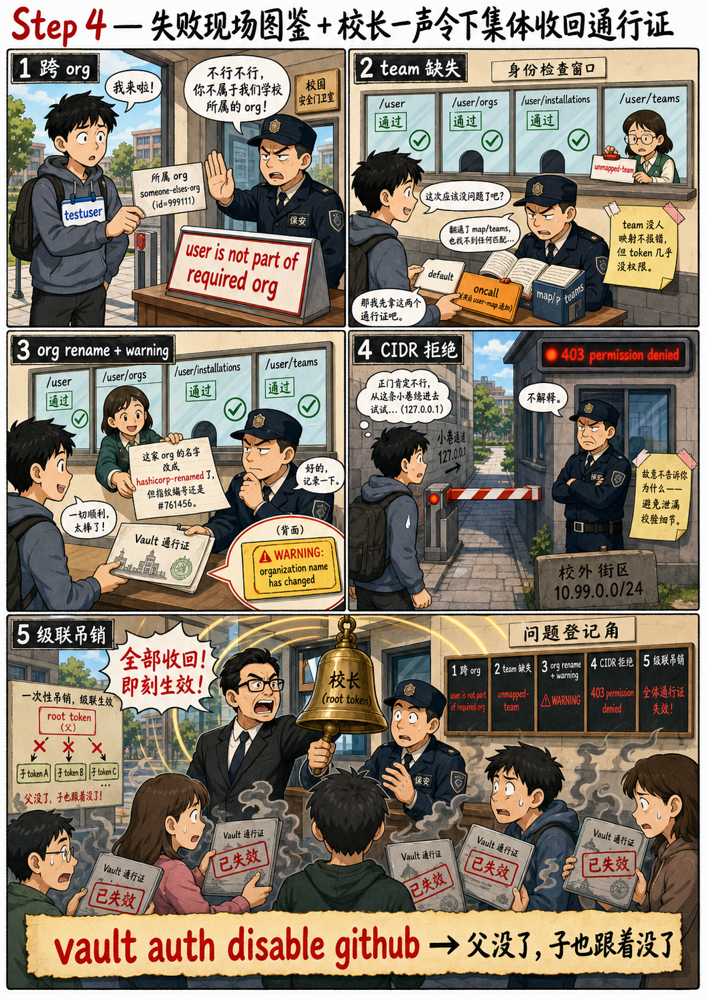

# 第四步：失败现场——跨 org / team 缺失 / org rename + 级联吊销



至此"真假 GitHub"已对接完毕。本步通过**修改 `github-mock.yaml`
后重启 prism**，构造生产环境中最常见的几类失败现场，最后通过
`vault auth disable github` 验证 [4.1 章](/ch4-auth-basic) 中介绍
的"禁用 auth method = 批量吊销由它签发的 token"机制。

> 修改 spec → 重启 prism 重复使用同一组命令：
> `pkill -f "prism mock"`、`nohup prism mock -h 127.0.0.1 -p 4010
> /root/github-mock.yaml > /var/log/prism.log 2>&1 &`、`sleep 2`。

## 4.1 失败现场（一）：用户不在目标 org

[4.4 章 §5.1](/ch4-github) 介绍了 Vault 校验
`/user/orgs` 必须包含 `config.organization_id` 的逻辑——如果该用
户并不属于 hashicorp，`/user/orgs` 不会返回 hashicorp，登录被
拒绝。

修改 mock，让 `/user/orgs` 只返回另一个 org：

```bash
# 备份原 spec
cp /root/github-mock.yaml /root/github-mock.yaml.bak

# 把 user/orgs 的 example 替换成另一个 org（id 不是 761456）
python3 - <<'PY'
import re
with open('/root/github-mock.yaml') as f:
    s = f.read()

new_orgs = """              example:
                - login: someone-elses-org
                  id: 999111
                  node_id: MDEyOk9yZ2FuaXphdGlvbjk5OTExMQ==
                  url: https://api.github.com/orgs/someone-elses-org"""

# 替换两次（v3+json 与 application/json 各一次）
s2 = re.sub(
    r'              example:\n                - login: hashicorp\n                  id: 761456\n                  node_id: MDEyOk9yZ2FuaXphdGlvbjc2MTQ1Ng==\n                  url: https://api\.github\.com/orgs/hashicorp',
    new_orgs, s)

with open('/root/github-mock.yaml', 'w') as f:
    f.write(s2)

print("替换完成")
PY

# 检查替换后 /user/orgs 的 example
grep -A 5 'listAuthenticatedUserOrgs' /root/github-mock.yaml | head -20
```

重启 prism：

```bash
pkill -f "prism mock" 2>/dev/null
sleep 1
nohup prism mock -h 127.0.0.1 -p 4010 /root/github-mock.yaml \
    > /var/log/prism.log 2>&1 &
sleep 2
curl -s http://127.0.0.1:4010/user/orgs | jq '.[].login'
```

应看到 `someone-elses-org`——/user/orgs 现在仅返回此 org。

尝试登录：

```bash
unset VAULT_TOKEN
vault login -method=github token=anything 2>&1 | head -10
```

应被拒绝，错误信息中包含 `user is not part of required org`：

```
Error authenticating: ...
Code: 500. Errors:

* user is not part of required org
```

> 这正是 [4.4 章 §5.1](/ch4-github) 中机制的实际表现——只要
> `/user/orgs` 返回的 id 列表中不包含 `config.organization_id`，
> 就直接拒绝、不会签发 token。

切回 root：

```bash
export VAULT_TOKEN=root
```

## 4.2 失败现场（二）：用户在 org 内但不属于任何被映射的 team

把 spec 还原，再修改 `/user/teams` 让用户只属于 `unmapped-team`
（无对应 policy 映射）：

```bash
cp /root/github-mock.yaml.bak /root/github-mock.yaml

python3 - <<'PY'
with open('/root/github-mock.yaml') as f:
    s = f.read()

import re
new_team_block = """              example:
                - id: 9001
                  node_id: MDQ6VGVhbTkwMDE=
                  name: unmapped-team
                  slug: unmapped-team
                  description: A team that has no policy mapping
                  permission: pull
                  url: https://api.github.com/teams/9001
                  organization:
                    login: hashicorp
                    id: 761456
                    node_id: MDEyOk9yZ2FuaXphdGlvbjc2MTQ1Ng==
                    url: https://api.github.com/orgs/hashicorp"""

s2 = re.sub(
    r'              example:\n                - id: 2001.+?(?=\n            \w|\nz)',
    new_team_block,
    s, flags=re.DOTALL)

with open('/root/github-mock.yaml', 'w') as f:
    f.write(s2)
PY

grep -A 4 'unmapped-team' /root/github-mock.yaml | head -10
```

重启 prism：

```bash
pkill -f "prism mock" 2>/dev/null
sleep 1
nohup prism mock -h 127.0.0.1 -p 4010 /root/github-mock.yaml \
    > /var/log/prism.log 2>&1 &
sleep 2
curl -s -H "Accept: application/vnd.github.hellcat-preview+json" \
    http://127.0.0.1:4010/user/teams | jq '.[].slug'
```

应看到 `unmapped-team`。

登录（本次会成功，但 token 几乎没有任何权限）：

```bash
unset VAULT_TOKEN
vault login -method=github token=anything

vault token lookup | grep -E 'policies|meta'
```

应看到：

- 登录**成功**（用户属于 hashicorp org，校验通过）
- `policies` 为 `[default oncall-policy]`——`oncall-policy` 来自
  `map/users/testuser`（user 映射不依赖 team）；team 这一侧没有任
  何映射命中，未叠加额外 policy
- 没有 `dev-policy`——dev team 不在 mock 返回的 team 列表中

> [4.4 章 §5](/ch4-github)："找不到任何匹配？Vault 不报错，token
> 只携带 `default` ... 这是个相对安全的默认。"叠加 user 映射的
> `oncall-policy` 同理：user-map 是对 team-map 的**追加**，并不依
> 赖 team-map 命中。

切回 root：

```bash
export VAULT_TOKEN=root
```

## 4.3 失败现场（三）：mock 把 org rename，查看 warning

把 spec 还原。然后把 `/user/orgs` 返回的 org **保留 id=761456，但
修改 login 名字**——模拟 GitHub 上 owner 把 org rename 的场景：

```bash
cp /root/github-mock.yaml.bak /root/github-mock.yaml

python3 - <<'PY'
with open('/root/github-mock.yaml') as f:
    s = f.read()
# 仅修改 login 名字，保留 id=761456——模拟 rename
s2 = s.replace('login: hashicorp\n                  id: 761456',
               'login: hashicorp-renamed\n                  id: 761456')
with open('/root/github-mock.yaml', 'w') as f:
    f.write(s2)
PY

grep -B 1 -A 1 '761456' /root/github-mock.yaml | head -20
```

重启 prism：

```bash
pkill -f "prism mock" 2>/dev/null
sleep 1
nohup prism mock -h 127.0.0.1 -p 4010 /root/github-mock.yaml \
    > /var/log/prism.log 2>&1 &
sleep 2
```

登录（会成功，但带有 warning）：

```bash
unset VAULT_TOKEN
vault login -method=github token=anything 2>&1 | head -25
```

应能看到形如：

```
WARNING! The following warnings were returned from Vault:
  * the organization name has changed to "hashicorp-renamed". It is recommended
    to verify and update the organization name in the config: organization_id=761456
```

> 这正是 [4.4 章 §4](/ch4-github) 介绍的 ID-first 校验防"同名空壳
> org 假冒"的实际表现——id 未变即接受，但提示运维"名字已经变
> 更"。Vault server log 中会同步记录该 warning。

切回 root + 还原 spec：

```bash
export VAULT_TOKEN=root
cp /root/github-mock.yaml.bak /root/github-mock.yaml
pkill -f "prism mock" 2>/dev/null
sleep 1
nohup prism mock -h 127.0.0.1 -p 4010 /root/github-mock.yaml \
    > /var/log/prism.log 2>&1 &
sleep 2
```

## 4.4 把 PAT 视为弱凭据：token_bound_cidrs 收紧来源

[4.4 章 §7](/ch4-github) 介绍的缓解措施之一：用
`token_bound_cidrs` 限定登录方源 IP。本实验中 Vault 看到的源 IP
是 `127.0.0.1`（CLI 与 vault server 同机），先把它写入 cidrs：

```bash
vault write auth/github/config \
    organization=hashicorp \
    organization_id=761456 \
    token_bound_cidrs=127.0.0.1/32

unset VAULT_TOKEN
vault login -method=github token=anything | grep -E 'token_bound_cidrs|policies'
```

应看到登录成功，token 上的 `token_bound_cidrs` 为
`[127.0.0.1/32]`。

把 cidrs 改为一个**不包含 127.0.0.1** 的网段再次尝试：

```bash
export VAULT_TOKEN=root
vault write auth/github/config \
    organization=hashicorp \
    organization_id=761456 \
    token_bound_cidrs=10.99.0.0/24

unset VAULT_TOKEN
vault login -method=github token=anything 2>&1 | head -5
```

应被拒绝：

```
Error authenticating: ...
Code: 403. Errors:
```

> github auth 后端在 `verifyCredentials` 第一步就比对源 IP 是否落
> 在 `token_bound_cidrs` 内——不在的话**直接返回 `permission
> denied`** 而**不会**给出详细的 CIDR 信息（这是有意设计：避免向
> 潜在攻击者泄漏校验细节）。要确认是 cidr 拦截了请求，可以查看
> vault server 的 debug 级别日志。
>
> 这条 cidr 校验是 token mount 通用的——参见
> [2.4 章 auth tokens](/ch2-auth-tokens)。用在 PAT 这类长效凭据上
> 尤其有意义：即便有人窃取了 PAT，也必须从允许的网段访问 Vault。

清掉 cidrs 还原：

```bash
export VAULT_TOKEN=root
vault write auth/github/config \
    organization=hashicorp \
    organization_id=761456 \
    token_bound_cidrs=
```

## 4.5 级联吊销：`vault auth disable github`

[4.1 章](/ch4-auth-basic) 中介绍的"禁用一个 Auth Method = 批量
登出所有通过它登录的 Token"——取一枚 github 签发的 token，然后
disable 该 method，观察该 token 是否立即失效：

```bash
unset VAULT_TOKEN
vault login -method=github token=anything > /dev/null
DEV_TOKEN=$(vault print token)
echo "DEV_TOKEN=$DEV_TOKEN"

# 验证此时 token 仍可使用
VAULT_TOKEN=$DEV_TOKEN vault token lookup | grep accessor
```

```bash
# disable github auth method
export VAULT_TOKEN=root
vault auth disable github

# 该 dev token 应立即失效
VAULT_TOKEN=$DEV_TOKEN vault token lookup 2>&1 | head -3
```

应看到：

```
Error looking up token: Error making API request.

URL: GET http://127.0.0.1:8200/v1/auth/token/lookup-self
```

> 这就是 mount-disable 的副作用——所有从该 mount 派生出来的 token
> 都会被一并删除。auth method 与它签发的 token 是父子关系，父被
> 删除子也随之失效。该机制在 [4.3 章 step 4](/ch4-aws) 的 aws
> auth 收尾中也有演示。

## 4.6 收尾：清理本实验

```bash
# 关闭 prism / nginx
pkill -f "prism mock" 2>/dev/null
nginx -s stop 2>/dev/null

# 还原 /etc/hosts
grep -v 'github\.com' /etc/hosts > /tmp/hosts.new
cat /tmp/hosts.new > /etc/hosts
grep github /etc/hosts || echo "(no github entries left)"

# 卸载自签 CA
rm -f /usr/local/share/ca-certificates/fakegh-api.github.com.crt
update-ca-certificates --fresh > /dev/null 2>&1

# 删除证书与 spec 备份
rm -rf /etc/ssl/fakegh /root/github-mock.yaml.bak
```

## 4.7 本步骤的核心闭环

通过"修改 mock spec → 重启 prism"的快速迭代循环，你完整观察了
Vault 在**真实生产场景中最常见的几类 GitHub 异常**下的响应行为：

| 异常 | Vault 行为 | 来源章节 |
| :-- | :-- | :-- |
| 用户不在目标 org 内 | 拒绝登录，`user is not part of required org` | [§5.1](/ch4-github) |
| 用户在 org 内但 team 无映射 | 登录成功，token 仅携带 default + user 映射的 policy | [§5](/ch4-github) |
| Org 被 rename（id 不变） | 登录成功，附带 warning 提示运维 | [§4](/ch4-github) |
| 来源 IP 不在 token_bound_cidrs | 拒绝登录，403 permission denied | [§7](/ch4-github) |
| Auth method 被 disable | 已签发的 token 全部级联失效 | [4.1 章](/ch4-auth-basic) |

更重要的是——你验证了 [4.4 章 §9](/ch4-github) 中的论断："Vault
使用 Go 的 `crypto/tls` 默认 SystemCertPool 加载根 CA"——把自签
CA 写到 `/usr/local/share/ca-certificates/` 就足以让 Vault 把它
视为合法 CA，全程不需要修改任何 Vault 配置。同样的手法可用于
air-gapped 环境下的协议演示与故障注入实验。但在生产接入 GHES
时**仍应走正规路径**：配置 `base_url=https://<ghes>/api/v3/` +
显式 `organization_id` + 合法 CA 链，**不要**把 hosts/CA 劫持
用于生产环境。
