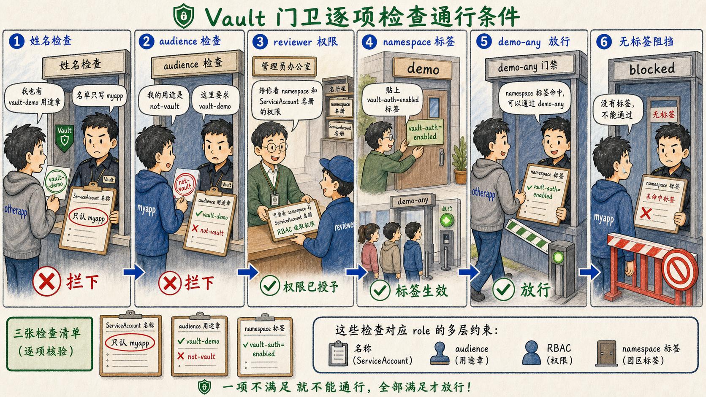

# 第三步：验证 ServiceAccount、namespace 与 audience 约束



Kubernetes TokenReview 只证明“这个 JWT 属于哪个 Kubernetes 身份且仍然有效”；Vault role 还会继续检查 ServiceAccount 名称、namespace、namespace selector 与 audience 等授权约束。

## 3.1 同 namespace 的其他 ServiceAccount 应被拒绝

先创建另一个 ServiceAccount，并用同样的 audience 生成 token。

```bash
kubectl create serviceaccount otherapp -n demo
OTHER_JWT=$(kubectl create token otherapp -n demo --audience=vault-demo --duration=10m)
```

尝试用 `otherapp` 登录只绑定 `myapp` 的 Vault role。

```bash
vault write auth/kubernetes/login role=myapp jwt="$OTHER_JWT"
```

这条命令应失败，因为 role 的 `bound_service_account_names` 只允许 `myapp`。

## 3.2 正确 ServiceAccount 但错误 audience 也应被拒绝

为 `myapp` 签发一枚 audience 不是 `vault-demo` 的 token。

```bash
WRONG_AUD_JWT=$(kubectl create token myapp -n demo --audience=not-vault --duration=10m)
vault write auth/kubernetes/login role=myapp jwt="$WRONG_AUD_JWT"
```

这条命令应失败，因为 Vault role 要求 `audience=vault-demo`，而 Kubernetes TokenReview 的 audience 语义要求 token 与请求的 audience 至少有一个兼容值。

## 3.3 为 namespace selector 补充读取权限

下一小节会使用 namespace label selector；官方 API 文档说明，使用 namespace selector 时 Vault 必须有权限读取 Kubernetes namespace。

```bash
kubectl apply -f - <<'EOF'
apiVersion: rbac.authorization.k8s.io/v1
kind: ClusterRole
metadata:
  name: vault-kubernetes-auth-read
rules:
- apiGroups: [""]
  resources: ["namespaces", "serviceaccounts"]
  verbs: ["get", "list"]
EOF

kubectl create clusterrolebinding vault-kubernetes-auth-read \
  --clusterrole=vault-kubernetes-auth-read \
  --serviceaccount=vault-system:vault-reviewer
```

这里同时给了 `serviceaccounts` 的读取权限，是为了第四步启用 ServiceAccount 注解到 alias metadata 的映射。

## 3.4 使用 namespace selector 放行带标签的 namespace

给 `demo` namespace 打上标签，并创建一个允许该标签 namespace 中任意 ServiceAccount 登录的 role。

```bash
kubectl label namespace demo vault-auth=enabled --overwrite

vault write auth/kubernetes/role/demo-any \
  bound_service_account_names='*' \
  bound_service_account_namespace_selector='{"matchLabels":{"vault-auth":"enabled"}}' \
  audience=vault-demo \
  token_policies=myapp-read \
  token_ttl=15m
```

用 `otherapp` 的 token 再登录一次；因为它所在 namespace 命中了 selector，且 role 允许任意 ServiceAccount 名称，这次应成功。

```bash
vault write -format=json auth/kubernetes/login role=demo-any jwt="$OTHER_JWT" \
  | jq '.auth.metadata'
```

## 3.5 未命中 selector 的 namespace 应被拒绝

创建一个没有 `vault-auth=enabled` 标签的 namespace，并尝试登录 `demo-any` role。

```bash
kubectl create namespace blocked
kubectl create serviceaccount myapp -n blocked
BLOCKED_JWT=$(kubectl create token myapp -n blocked --audience=vault-demo --duration=10m)

vault write auth/kubernetes/login role=demo-any jwt="$BLOCKED_JWT"
```

这条命令应失败，因为 namespace 既不在显式允许列表中，也没有命中 namespace selector。

## 3.6 这一步的核心闭环

Kubernetes auth 的授权面由多层条件共同决定：TokenReview 负责证明 JWT 的真实性与当前有效性，Vault role 负责限制 ServiceAccount 名称、namespace 范围、namespace label selector、audience 与最终 token policy。
