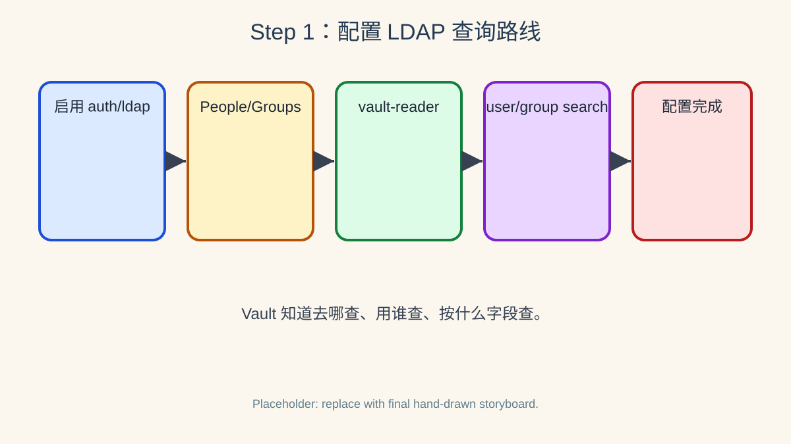

# 第一步：启用 ldap auth 并配置 OpenLDAP 查询



> 绘图提示词：手绘风格，现实事物比喻风格，彩色横向故事板，分成 5 格。第 1 格画管理员打开 Vault 的 `auth/ldap` 门；第 2 格画 OpenLDAP 档案柜，柜子分成 `ou=People` 和 `ou=Groups` 两层；第 3 格画管理员把 `vault-reader` 查询证交给 Vault 前台；第 4 格画 Vault 前台拿查询证到 `ou=People` 找 `uid` 用户，到 `ou=Groups` 找 `member` 组名单；第 5 格画 Vault 前台把“连接配置完成”章盖在配置表上。气泡方向必须明确：管理员对 Vault 说“启用 ldap auth”；管理员对 Vault 说“用 vault-reader 去查目录”；Vault 对 OpenLDAP 说“我只查用户和组”；OpenLDAP 对 Vault 回答“People 和 Groups 抽屉在这里”。所有气泡尾巴连接说话者，小箭头指向接收者。

LDAP auth 必须先启用并配置，Vault 才知道去哪个 LDAP 服务器、用哪个查询账号、在哪些目录分支下查用户和组。

## 1.1 先确认 OpenLDAP 里有什么

先用管理员账号从 LDAP 端查看预置用户和组；这一步帮助你把后面的 Vault 配置字段和真实 LDAP 目录结构对应起来。

```bash
ldapsearch -x -LLL -H ldap://127.0.0.1:389 \
  -D "cn=admin,dc=example,dc=org" -w admin \
  -b "ou=People,dc=example,dc=org" \
  "(objectClass=inetOrgPerson)" uid cn employeeType

ldapsearch -x -LLL -H ldap://127.0.0.1:389 \
  -D "cn=admin,dc=example,dc=org" -w admin \
  -b "ou=Groups,dc=example,dc=org" \
  "(objectClass=groupOfNames)" cn member
```

应能看到 `alice`、`bob`、`carol`、`vault-reader` 四个用户，以及 `dev`、`ops`、`contractors` 三个组。

## 1.2 直接验证一个 LDAP 密码

`ldapwhoami` 可以直接做一次 LDAP bind；如果 Alice 的密码正确，LDAP 会返回 Alice 的 DN。

```bash
ldapwhoami -x -H ldap://127.0.0.1:389 \
  -D "uid=alice,ou=People,dc=example,dc=org" \
  -w alice-pass
```

这一步和 Vault 还没有关系，它只是证明 LDAP 端确实接受 `alice / alice-pass` 这组凭据。

## 1.3 启用 LDAP auth method

启用认证方法会在 `auth/ldap/` 下挂载一个 LDAP auth 插件；后续配置和登录端点都以这个路径为前缀。

```bash
vault auth enable ldap
vault auth list | grep ldap
```

应看到类似 `ldap/    ldap    auth_ldap_xxxxx` 的输出；第三列是这个 auth mount 的 accessor。

## 1.4 写入 LDAP 连接、用户搜索与组搜索配置

这里使用 authenticated search：Vault 先用 `vault-reader` 搜索用户和组，再用登录用户自己的密码验证用户身份。

```bash
vault write auth/ldap/config \
  url="ldap://127.0.0.1:389" \
  binddn="uid=vault-reader,ou=People,dc=example,dc=org" \
  bindpass="reader-pass" \
  userdn="ou=People,dc=example,dc=org" \
  userattr="uid" \
  groupdn="ou=Groups,dc=example,dc=org" \
  groupfilter="(&(objectClass=groupOfNames)(member={{.UserDN}}))" \
  groupattr="cn" \
  token_ttl="15m"
```

`userattr=uid` 表示登录名 `alice` 要去匹配用户对象上的 `uid` 属性；`groupfilter` 表示 Vault 会查找 `member` 等于当前用户 DN 的 `groupOfNames` 组对象；`groupattr=cn` 表示用组对象的 `cn` 当作组名。

## 1.5 回读配置

读取配置时，Vault 不会回显 `bindpass` 明文，这是正常行为。

```bash
vault read auth/ldap/config
```

你应能看到 `url`、`binddn`、`userdn`、`userattr`、`groupdn`、`groupfilter`、`groupattr` 等字段。

## 1.6 这一步的核心闭环

到这里，Vault 已经知道“去哪里查 LDAP、用谁去查、怎么把用户名变成用户 DN、怎么把用户 DN 变成组名”；下一步才会把这些 LDAP 组映射到 Vault policy，并真正登录 Vault。