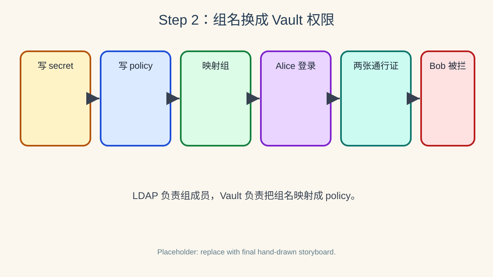

# 第二步：LDAP 组映射到 Vault policy 并完成登录



> 绘图提示词：手绘风格，现实事物比喻风格，彩色横向故事板，分成 6 格。第 1 格画 Vault 保险柜里放入 `secret/dev/app` 和 `secret/ops/runbook` 两个文件夹；第 2 格画管理员写两张 policy 纸条：`dev-read` 只能读 dev 文件夹，`ops-read` 只能读 ops 文件夹；第 3 格画 Vault 把 LDAP `dev` 组映射到 `dev-read`，把 LDAP `ops` 组映射到 `ops-read`；第 4 格画 Alice 用 LDAP 密码登录，LDAP 组名单墙回答她属于 `dev` 和 `ops`；第 5 格画 Vault 给 Alice 发两张通行证，Alice 能打开 dev 和 ops 文件夹；第 6 格画 Bob 登录后只拿到 `dev-read`，在 ops 文件夹前被拦下。气泡方向必须明确：Alice 对 Vault 说“我用 alice-pass 登录”；Vault 对 LDAP 组名单墙说“Alice 属于哪些组？”；组名单墙对 Vault 回答“dev 和 ops”；Vault 对 Alice 说“给你 dev-read + ops-read”；Vault 对 Bob 说“你只有 dev-read”。气泡尾巴连接说话者，小箭头指向接收者。

LDAP 登录本身只证明“这个人是谁、属于哪些 LDAP 组”；真正决定能读哪些 Vault 路径的是 Vault policy。LDAP auth 通过 `auth/ldap/groups/<group>` 把 LDAP 组名映射到 Vault policy。

## 2.1 准备两份教学 secret

先写入两个 KV v2 secret：一个代表开发环境配置，一个代表运维 runbook。

```bash
vault kv put secret/dev/app username=dev-user password=dev-pass
vault kv put secret/ops/runbook contact=oncall procedure=restart-service
```

## 2.2 创建 Vault policy

`dev-read` 只允许读取 `secret/dev/app`，`ops-read` 只允许读取 `secret/ops/runbook`。

```bash
cat > dev-read.hcl <<'EOF'
path "secret/data/dev/app" {
  capabilities = ["read"]
}
EOF

cat > ops-read.hcl <<'EOF'
path "secret/data/ops/runbook" {
  capabilities = ["read"]
}
EOF

vault policy write dev-read dev-read.hcl
vault policy write ops-read ops-read.hcl
```

## 2.3 把 LDAP 组映射到 Vault policy

这里把 LDAP 组 `dev` 映射到 Vault policy `dev-read`，把 LDAP 组 `ops` 映射到 Vault policy `ops-read`。

```bash
vault write auth/ldap/groups/dev policies=dev-read
vault write auth/ldap/groups/ops policies=ops-read

vault list auth/ldap/groups
vault read auth/ldap/groups/dev
vault read auth/ldap/groups/ops
```

## 2.4 Alice 登录并读取两份 secret

Alice 在 OpenLDAP 中同时属于 `dev` 和 `ops`，因此她登录后应同时获得 `dev-read` 与 `ops-read`。

```bash
ALICE_LOGIN=$(VAULT_LDAP_PASSWORD=alice-pass vault login -method=ldap username=alice -format=json)
echo "$ALICE_LOGIN" | jq '.auth | {policies, metadata, lease_duration, renewable}'
ALICE_TOKEN=$(echo "$ALICE_LOGIN" | jq -r '.auth.client_token')

VAULT_TOKEN="$ALICE_TOKEN" vault kv get secret/dev/app
VAULT_TOKEN="$ALICE_TOKEN" vault kv get secret/ops/runbook
```

输出中的 policies 应包含 `dev-read` 与 `ops-read`；这说明 Vault 根据 LDAP 组成员关系在 token 创建时附加了对应 policy。

## 2.5 Bob 登录并验证 ops 被拒绝

Bob 只属于 LDAP `dev` 组，不属于 `ops` 组，因此他应该能读开发 secret，但不能读运维 runbook。

```bash
BOB_LOGIN=$(VAULT_LDAP_PASSWORD=bob-pass vault login -method=ldap username=bob -format=json)
echo "$BOB_LOGIN" | jq '.auth | {policies, metadata}'
BOB_TOKEN=$(echo "$BOB_LOGIN" | jq -r '.auth.client_token')

VAULT_TOKEN="$BOB_TOKEN" vault kv get secret/dev/app
VAULT_TOKEN="$BOB_TOKEN" vault kv get secret/ops/runbook
```

最后一条命令应失败；这不是 LDAP 密码错误，而是 Bob 的 Vault token 没有 `ops-read` policy。

## 2.6 这一步的核心闭环

LDAP 负责告诉 Vault “Alice 属于 dev 和 ops，Bob 只属于 dev”；Vault 负责把这些组名映射成 policy，并让签发出的 Vault token 只能访问对应路径。