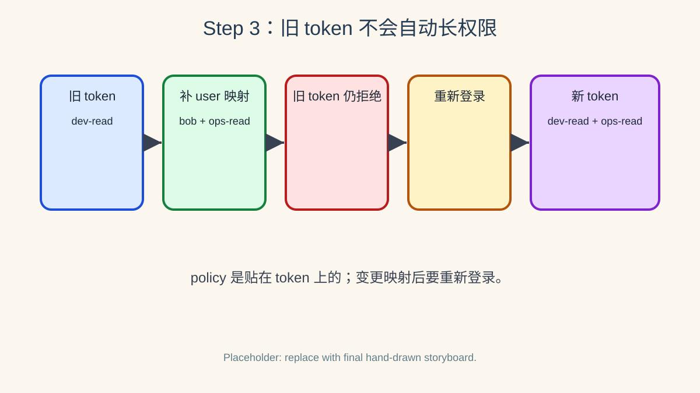

# 第三步：用户映射与 token 创建时刻



> 绘图提示词：手绘风格，现实事物比喻风格，彩色横向故事板，主题是“policy 在 token 创建时刻贴上去”。第 1 格画 Bob 拿旧 Vault token，只带 `dev-read` 贴纸；第 2 格画管理员在 Vault 本地用户映射柜 `auth/ldap/users/bob` 上补贴 `ops-read`；第 3 格画 Bob 拿旧 token 去 ops 保险柜仍被拦下，门卫指着旧贴纸说“这张通行证没有 ops-read”；第 4 格画 Bob 重新用 LDAP 密码登录；第 5 格画 Vault 发新 token，上面同时贴着 `dev-read` 和 `ops-read`；第 6 格画新 token 打开 ops 文件夹。气泡方向必须明确：管理员对 Vault 用户映射柜说“给 bob 追加 ops-read”；Bob 对 Vault 门卫说“我用旧 token 试试”；Vault 门卫对 Bob 回答“旧 token 不会自动变”；Bob 对 Vault 登录柜台说“我重新登录”；Vault 对 Bob 说“这是带新 policy 的 token”。气泡尾巴连接说话者，小箭头指向接收者。

Vault 的 LDAP user 映射可以给单个 LDAP 用户附加 policy；但官方文档提醒，policy 映射发生在 token 创建时，旧 token 不会因为映射变化自动更新。

## 3.1 先用 Bob 的旧 token 再试一次 ops 路径

Step 2 里 Bob 登录得到的 `BOB_TOKEN` 只带 `dev-read`，所以它不能读取 ops runbook。

```bash
VAULT_TOKEN="$BOB_TOKEN" vault kv get secret/ops/runbook
```

这条命令应失败，作为后面“旧 token 不自动变”的对照基线。

## 3.2 给 Bob 添加 Vault 本地 user 映射

下面的命令并不会修改 OpenLDAP 里的 Bob，也不会把 Bob 加进 LDAP `ops` 组；它只是在 Vault 的 LDAP auth mount 内部记录“bob 这个 LDAP 用户额外带 `ops-read` policy”。

```bash
vault write auth/ldap/users/bob policies=ops-read
vault read auth/ldap/users/bob
```

## 3.3 旧 token 仍然不能读取 ops

再次用旧的 `BOB_TOKEN` 访问 ops 路径；它仍应失败，因为这个 token 创建时还没有 `ops-read`。

```bash
VAULT_TOKEN="$BOB_TOKEN" vault kv get secret/ops/runbook
```

## 3.4 Bob 重新登录后获得新 policy

让 Bob 重新用 LDAP 密码登录；这一次 token 创建时会读取新的 user 映射，因此应包含 `ops-read`。

```bash
BOB_LOGIN_2=$(VAULT_LDAP_PASSWORD=bob-pass vault login -method=ldap username=bob -format=json)
echo "$BOB_LOGIN_2" | jq '.auth | {policies, metadata}'
BOB_TOKEN_2=$(echo "$BOB_LOGIN_2" | jq -r '.auth.client_token')

VAULT_TOKEN="$BOB_TOKEN_2" vault kv get secret/ops/runbook
```

如果读取成功，说明 Vault 本地 user 映射已经在新 token 上生效。

## 3.5 这一步的核心闭环

LDAP auth 的授权结果不是“实时跟随 LDAP 或 Vault 映射变化”的动态视图，而是登录那一刻固化到 Vault token 上的一组 policy；变更映射后，通常需要吊销旧 token 并重新登录。