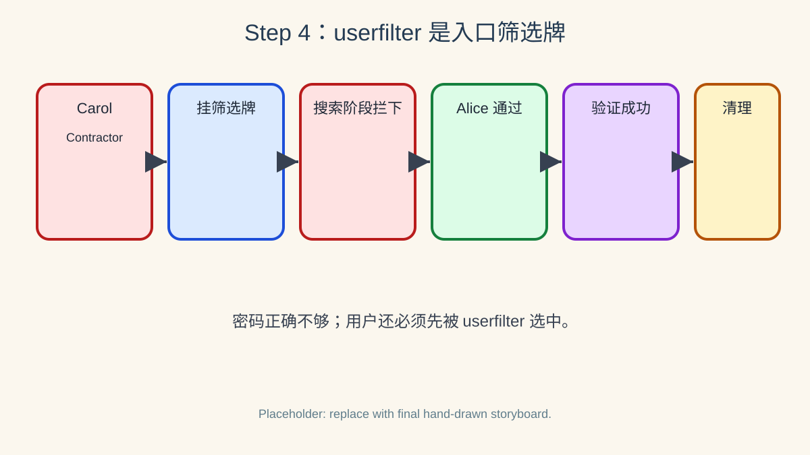

# 第四步：userfilter 拦截 contractors 并清理环境



> 绘图提示词：手绘风格，现实事物比喻风格，彩色横向故事板，分成 6 格。第 1 格画 Carol 的 LDAP 工牌，上面写 `employeeType=Contractor`；第 2 格画 Vault 管理员把一块筛选牌挂到 LDAP 搜索窗口，上面写“不要 Contractor”；第 3 格画 Vault 搜索 `uid=carol` 时，筛选牌先拦住 Carol 的档案；第 4 格画 Carol 对 Vault 说“我有正确密码”，Vault 回答“搜索规则不允许你进入候选名单”；第 5 格画 Alice 的工牌写 `employeeType=Employee`，通过筛选后正常登录；第 6 格画管理员关闭 `auth/ldap` 并收拾 OpenLDAP 实验柜台。气泡方向必须明确：管理员对 Vault 说“加上 userfilter”；Vault 对 LDAP 搜索窗口说“只找非 Contractor 用户”；Carol 对 Vault 说“我的密码是对的”；Vault 对 Carol 说“但你被 userfilter 排除”；Vault 对 Alice 说“你通过筛选，可以继续认证”。所有气泡尾巴连接说话者，小箭头指向接收者。

`userfilter` 可以在用户搜索阶段附加限制；它不是改 LDAP 密码校验，而是先决定“这个用户名能否被搜索成一个允许登录的用户对象”。

## 4.1 先确认 Carol 现在能登录

在没有额外 `userfilter` 限制时，Carol 是一个真实 LDAP 用户，密码也正确；她是否拿到有用 policy 是另一回事。

```bash
CAROL_LOGIN=$(VAULT_LDAP_PASSWORD=carol-pass vault login -method=ldap username=carol -format=json)
echo "$CAROL_LOGIN" | jq '.auth | {policies, metadata}'
```

由于 `contractors` 组还没有映射任何 policy，Carol 通常只会得到 `default` policy。

## 4.2 加上排除 Contractor 的 userfilter

下面重新写入 LDAP 配置，保留连接、用户搜索与组搜索字段，同时增加 `userfilter`；过滤器保留 `{{.UserAttr}}={{.Username}}`，并排除 `employeeType=Contractor` 的条目。

```bash
vault write auth/ldap/config \
  url="ldap://127.0.0.1:389" \
  binddn="uid=vault-reader,ou=People,dc=example,dc=org" \
  bindpass="reader-pass" \
  userdn="ou=People,dc=example,dc=org" \
  userattr="uid" \
  userfilter="(&(objectClass=inetOrgPerson)({{.UserAttr}}={{.Username}})(!(employeeType=Contractor)))" \
  groupdn="ou=Groups,dc=example,dc=org" \
  groupfilter="(&(objectClass=groupOfNames)(member={{.UserDN}}))" \
  groupattr="cn" \
  token_ttl="15m"
```

官方 API 文档建议，定制 `userfilter` 时应包含 `{{.UserAttr}}` 或与 `userattr` 对应的字面属性，以免搜索结果和 alias 映射出现歧义。

## 4.3 Carol 应被拒绝，Alice 仍可登录

Carol 的 `employeeType=Contractor`，因此现在应在用户搜索阶段被排除；Alice 的 `employeeType=Employee`，应仍可正常登录。

```bash
VAULT_LDAP_PASSWORD=carol-pass vault login -method=ldap username=carol

ALICE_LOGIN_2=$(VAULT_LDAP_PASSWORD=alice-pass vault login -method=ldap username=alice -format=json)
echo "$ALICE_LOGIN_2" | jq '.auth | {policies, metadata}'
```

如果 Carol 登录失败而 Alice 仍成功，说明 `userfilter` 正在按 LDAP 用户属性缩小允许登录的人群。

## 4.4 收尾清理

禁用 auth method 会移除该 mount 下的配置和映射，并使通过该 auth method 签发的 token 失效；这里同时停止 OpenLDAP 容器，恢复实验环境。

```bash
vault auth disable ldap || true
docker rm -f openldap || true
```

## 4.5 这一步的核心闭环

`userfilter` 是 LDAP auth 的“入口筛选牌”：密码正确不代表一定能登录，用户还必须先被过滤器选中；这让管理员可以把目录中的某些账号类别排除在 Vault 登录入口之外。