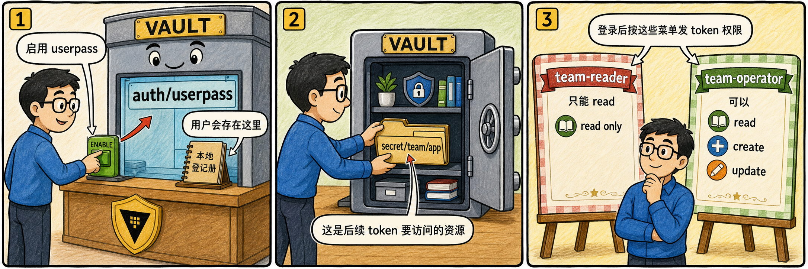

# 第一步：启用 userpass 并准备 policy



先启用默认路径的 `userpass` auth method，再准备一个教学 secret 和两份 policy。

## 1.1 启用 userpass

```bash
vault auth enable userpass
vault auth list | grep userpass
```

默认挂载路径是 `auth/userpass/`；如果用 `-path` 改了路径，CLI/API 的路径也要跟着改。

## 1.2 准备教学 secret

```bash
vault kv put secret/team/app username=service password=initial-value
```

## 1.3 创建 reader policy

```bash
cat > team-reader.hcl <<'EOF'
path "secret/data/team/app" {
  capabilities = ["read"]
}
EOF

vault policy write team-reader team-reader.hcl
```

## 1.4 创建 operator policy

```bash
cat > team-operator.hcl <<'EOF'
path "secret/data/team/app" {
  capabilities = ["create", "update", "read"]
}
EOF

vault policy write team-operator team-operator.hcl
```

## 1.5 这一步的核心闭环

`userpass` 只负责把用户名密码换成 Vault token；登录后能做什么，仍然由 policy 决定。