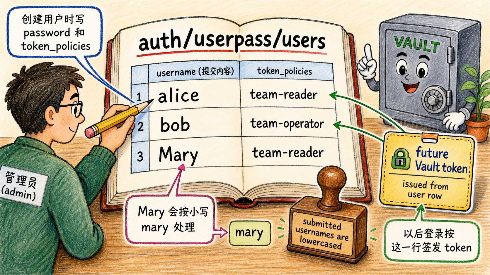

# 第二步：创建用户并查看用户登记册



用户条目直接写在 `auth/userpass/users/<username>` 下。创建用户时提供 `password` 或 bcrypt `password_hash`，并设置登录后 token 使用的 policy。

## 2.1 创建 alice 与 bob

```bash
vault write auth/userpass/users/alice \
  password="alice-pass" \
  token_policies="team-reader" \
  token_ttl="20m"

vault write auth/userpass/users/bob \
  password="bob-pass" \
  token_policies="team-operator" \
  token_ttl="20m"
```

## 2.2 创建一个带大写字母的 Mary

```bash
vault write auth/userpass/users/Mary \
  password="mary-pass" \
  token_policies="team-reader" \
  token_ttl="20m"
```

官方文档说明，提交的用户名会被小写化，`Mary` 和 `mary` 是同一个条目。

## 2.3 列出用户

```bash
vault list auth/userpass/users
```

你应能看到用户列表。大小写显示以 Vault 实际保存结果为准，但登录时 `Mary`、`MARY`、`mary` 会归一到同一用户名。

## 2.4 读取用户配置

```bash
vault read auth/userpass/users/alice
vault read auth/userpass/users/bob
```

读取用户会返回 token 参数，例如 `token_policies`、`token_ttl`、`token_max_ttl` 等；不会返回明文密码。

## 2.5 这一步的核心闭环

`userpass` 的“用户数据库”就在 Vault auth method 自己的路径里；它不会去外部目录查用户名密码。