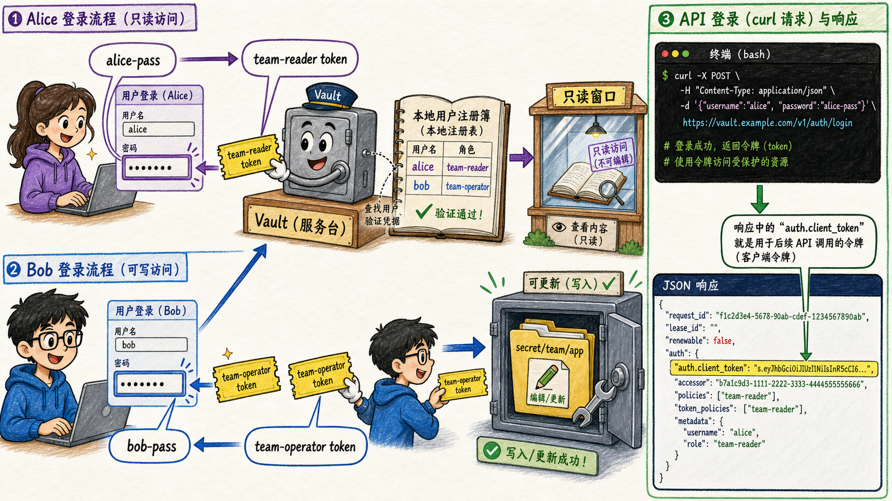

# 第三步：使用 CLI/API 登录并验证 token 权限



> 绘图提示词：手绘风格，现实事物比喻风格，彩色横向故事板。左边画 alice 输入用户名密码，Vault 查登记册后发 `team-reader` token，alice 只能打开读取窗口；下方画 bob 输入用户名密码，Vault 发 `team-operator` token，bob 可以更新 `secret/team/app`。右侧画一个 API curl 请求拿到 `auth.client_token`。气泡方向必须非常细致：alice 气泡放在左上，尾巴连接到 alice 的密码输入框，箭头水平指向 Vault，台词“alice-pass”；Vault 给 alice 的气泡放在 Vault 上方偏左，尾巴连接到递给 alice 的 `team-reader` token，箭头回到 alice 手中，台词“team-reader token”；bob 气泡放在左下，尾巴连接到 bob 的密码输入框，箭头斜向上指向 Vault，台词“bob-pass”；Vault 给 bob 的气泡放在 Vault 下方偏右，尾巴连接到递给 bob 的 `team-operator` token，箭头回到 bob 手中，台词“team-operator token”；curl/API 气泡放在最右侧响应框上方，尾巴垂直指向 JSON 里的 `auth.client_token` 字段。alice 的箭头走上方，bob 的箭头走下方，避免两条登录路径交叉。

登录成功后，响应里的 `auth.client_token` 就是后续访问 Vault 的 token；`auth.policies` / `auth.token_policies` 展示这枚 token 带了哪些 policy。

## 3.1 alice 用 CLI 登录

```bash
ALICE_LOGIN=$(vault login \
  -method=userpass \
  username=alice \
  password=alice-pass \
  -format=json)

echo "$ALICE_LOGIN" | jq '.auth | {policies, token_policies, metadata, lease_duration}'
ALICE_TOKEN=$(echo "$ALICE_LOGIN" | jq -r '.auth.client_token')
```

## 3.2 alice 可以读，但不能写

```bash
VAULT_TOKEN="$ALICE_TOKEN" vault kv get secret/team/app

VAULT_TOKEN="$ALICE_TOKEN" vault kv put secret/team/app username=service password=alice-try
```

第二条写入命令应该失败，因为 `team-reader` 只有 `read` 能力。

## 3.3 bob 用 API 登录

```bash
BOB_LOGIN=$(curl --silent \
  --request POST \
  --data '{"password":"bob-pass"}' \
  "$VAULT_ADDR/v1/auth/userpass/login/bob")

echo "$BOB_LOGIN" | jq '.auth | {policies, token_policies, metadata, lease_duration}'
BOB_TOKEN=$(echo "$BOB_LOGIN" | jq -r '.auth.client_token')
```

API 登录路径是 `/auth/userpass/login/:username`，请求体中提交 `password`，响应里的 token 位于 `auth.client_token`。

## 3.4 bob 可以更新 secret

```bash
VAULT_TOKEN="$BOB_TOKEN" vault kv put secret/team/app username=service password=updated-by-bob
VAULT_TOKEN="$BOB_TOKEN" vault kv get secret/team/app
```

## 3.5 这一步的核心闭环

同一个 auth method 可以给不同用户签发不同 policy 的 token；身份验证回答“你是谁”，policy 继续回答“你能做什么”。