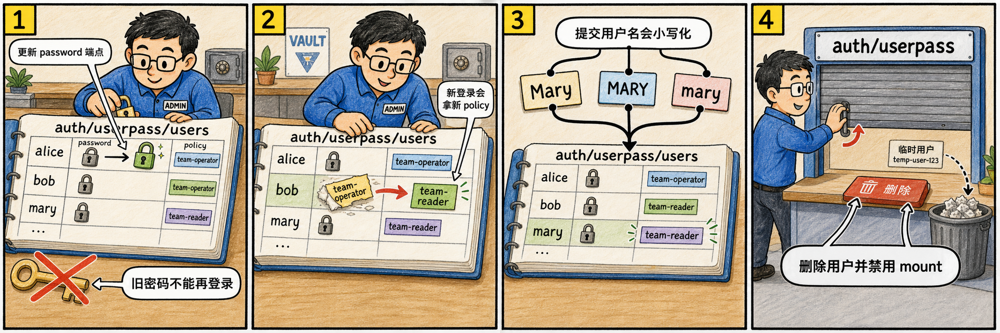

# 第四步：改密码、改 policy、验证小写归一化并清理



> 绘图提示词：手绘风格，现实事物比喻风格，彩色横向故事板。画管理员维护 `auth/userpass/users` 登记册：第一格给 alice 换密码锁，旧钥匙被打叉；第二格把 bob 的 policy 贴纸从 `team-operator` 换成 `team-reader`；第三格 Mary、MARY、mary 三个名牌被归到同一行 `mary`；第四格管理员删除临时用户并关闭 userpass 窗口。气泡方向必须非常细致：第一格管理员气泡放在 alice 行左上方，尾巴连接到 password 小锁，台词“更新 password 端点”；第一格旧钥匙气泡放在被打叉的旧钥匙旁，尾巴直接连到旧钥匙，台词“旧密码不能再登录”；第二格 bob 气泡放在 bob 行右侧，尾巴连接到从 `team-operator` 撕下再贴成 `team-reader` 的 policy 贴纸，台词“新登录会拿新 policy”；第三格 Mary 名牌气泡放在三个名牌上方，尾巴分三叉分别连到 Mary、MARY、mary，再汇入登记册里的 `mary` 行，台词“提交用户名会小写化”；第四格清理气泡放在关闭的 userpass 窗口外侧，尾巴连接到删除按钮和关闭门把手，台词“删除用户并禁用 mount”。每一格的气泡都留在本格内部，不跨格，不遮挡用户名和 policy 贴纸。

userpass API 为维护动作提供了独立端点：改密码、改 policies、删除用户、列出用户都不是同一个语义。

## 4.1 更新 alice 密码

```bash
vault write auth/userpass/users/alice/password password="new-alice-pass"
```

旧密码现在应无法登录，新密码可以登录。

```bash
vault login -method=userpass username=alice password=alice-pass

vault login -method=userpass username=alice password=new-alice-pass
```

## 4.2 更新 bob 的 policies

```bash
vault write auth/userpass/users/bob/policies token_policies="team-reader"

vault login -method=userpass username=bob password=bob-pass -format=json | jq '.auth.token_policies'
```

这个更新影响后续新登录签发出来的 token policies。

## 4.3 验证用户名小写归一化

```bash
vault login -method=userpass username=MARY password=mary-pass -format=json | jq '.auth.metadata'
vault login -method=userpass username=mary password=mary-pass -format=json | jq '.auth.metadata'
```

官方文档说明，提交的用户名会小写化，所以 `MARY` 和 `mary` 会命中同一个用户条目。

## 4.4 删除用户并清理 auth method

```bash
vault delete auth/userpass/users/alice
vault delete auth/userpass/users/bob
vault delete auth/userpass/users/mary
vault auth disable userpass
```

删除用户会移除这个用户名条目；禁用 auth method 会清理整个 `auth/userpass` mount。

## 4.5 这一步的核心闭环

userpass 是本地、直接、低依赖的用户名密码 auth method；它的简单性来自“用户就在 Vault auth method 内部”，也意味着你要自己负责这些用户的生命周期和安全边界。