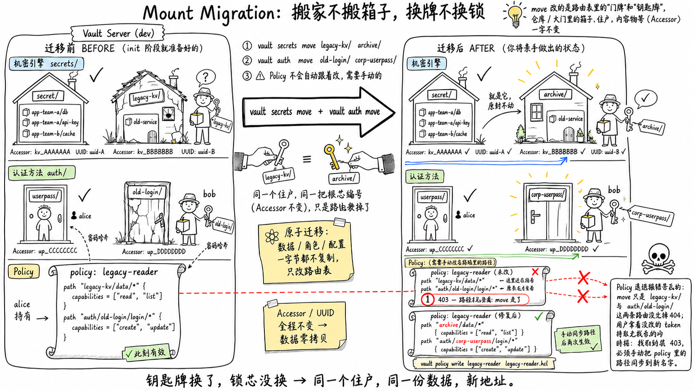

# 实验：引擎挂载点无损热迁移（Mount Migration）

在生产环境中，随着团队重组、命名规范的变化，你会需要把一个机密引擎或认证方法从旧路径**搬到新路径**。在 Vault 早期版本里，这意味着：手动导出所有数据 → 在新路径重新创建引擎 → 导入数据 → 删除旧路径。全程数据丢失风险极大，且关联的角色和配置无法迁移。

从 Vault 1.10 开始，`sys/remount` API（CLI 对应 `vault secrets move` 和 `vault auth move`）彻底终结了手动搬迁时代——**引擎下的所有数据、角色、配置，瞬间原子迁移到新路径**。

本实验环境已预先准备了：

- KV v2 引擎挂载在 `secret/`，包含 `app-team-a/` 和 `app-team-b/` 下的测试机密
- KV v2 引擎挂载在 `legacy-kv/`，包含一条遗留数据
- Userpass 认证挂载在 `userpass/`，用户 `alice`
- Userpass 认证挂载在 `old-login/`，用户 `bob`
- 一条引用 `secret/data/app-team-a/*` 路径的 Policy

下图展示了迁移前的状态、即将执行的迁移计划，以及迁移后期望看到的结果——
**注意：仓库 / 大门里的"住户"（数据、用户）和"编号"（Accessor / UUID）
全程不变，变的只是屋顶上的"门牌"（挂载路径）**：

你将亲手执行机密引擎迁移、认证方法迁移，并观察迁移后 Policy 的行为变化。
