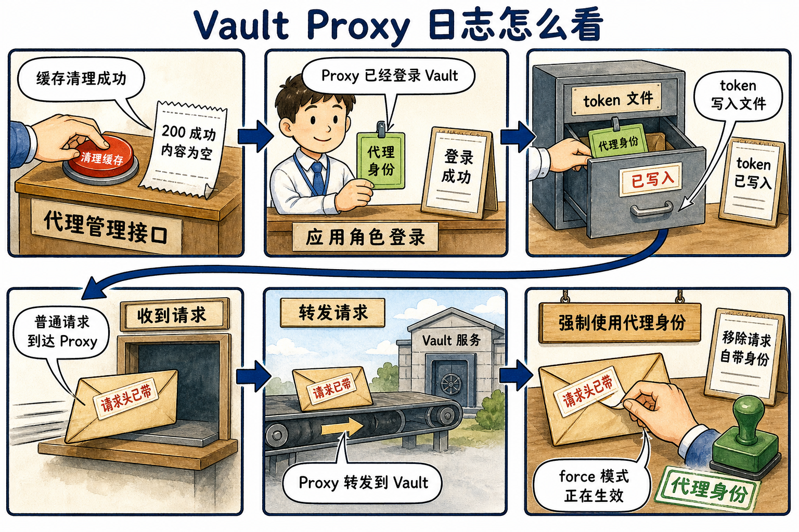

# 第四步：缓存清理、日志与错误定位

本实验配置了空的 `cache {}` 块，因此 Proxy 的缓存子系统已启用。为了避免把静态 KV 缓存和企业级事件订阅混入基础实验，这里只调用缓存清理 API，确认 Proxy API 入口可用。

```bash
cat > /tmp/cache-clear.json <<'EOF'
{
  "type": "all"
}
EOF

curl -s -i \
  -H "X-Vault-Request: true" \
  --request POST \
  --data @/tmp/cache-clear.json \
  http://127.0.0.1:8100/proxy/v1/cache-clear | head -12
```

这里先看 `curl` 输出，不必先翻日志：看到 `HTTP/1.1 200 OK` 且 `Content-Length: 0`，就说明缓存清理 API 调用成功。

再看 Proxy 日志。日志主要帮你确认两件事：Proxy 是否已经用 AppRole 登录成功，以及第三步的普通 Vault API 请求是否真的被 Proxy 转发到了 Vault。`/proxy/v1/cache-clear` 是 Proxy 自己的管理接口，成功时不一定会打印一条明显的 `received request` 日志，所以不要把“日志里没看到 cache-clear”当成失败。

```bash
tail -120 /tmp/vault-proxy.log | grep -E 'authentication successful|token written|proxy.cache|received request|forwarding request|stripping auto-auth'
```

大致这样理解这些日志行：

| 日志或输出 | 说明 |
| :--- | :--- |
| `HTTP/1.1 200 OK` | 刚才的 cache-clear 请求成功 |
| `authentication successful` | Proxy 已经通过 AppRole 登录 Vault |
| `token written` | Auto-auth token 已写入 `/root/proxy-token` |
| `received request` / `forwarding request` | 第三步的普通 Vault API 请求经过 Proxy 转发 |
| `stripping auto-auth token` | `use_auto_auth_token = "force"` 正在生效 |




用下面的表格整理排错思路。

| 现象 | 常见原因 | 首要检查点 |
| :--- | :--- | :--- |
| Proxy 进程未启动 | 配置语法错误、端口占用、AppRole 文件缺失 | `/tmp/vault-proxy.log` |
| 返回 412 | listener 要求 `X-Vault-Request: true` | 请求头是否存在 |
| 返回 403 | Vault policy 拒绝最终 token | `VAULT_TOKEN=$(cat /root/proxy-token) vault token capabilities <path>` |
| 请求没有使用预期身份 | `use_auto_auth_token` 模式理解错误 | `api_proxy` 块是 `true` 还是 `"force"` |

最后停止 Proxy，避免后台进程继续占用端口。

```bash
kill "$(cat /tmp/vault-proxy.pid)"
```

这一阶段的关键点是：Proxy 相关问题要分层排查，先看 Proxy listener 是否接受请求，再看 Proxy 是否成功 Auto-auth，最后再看 Vault policy 是否允许最终 token 访问目标路径。
